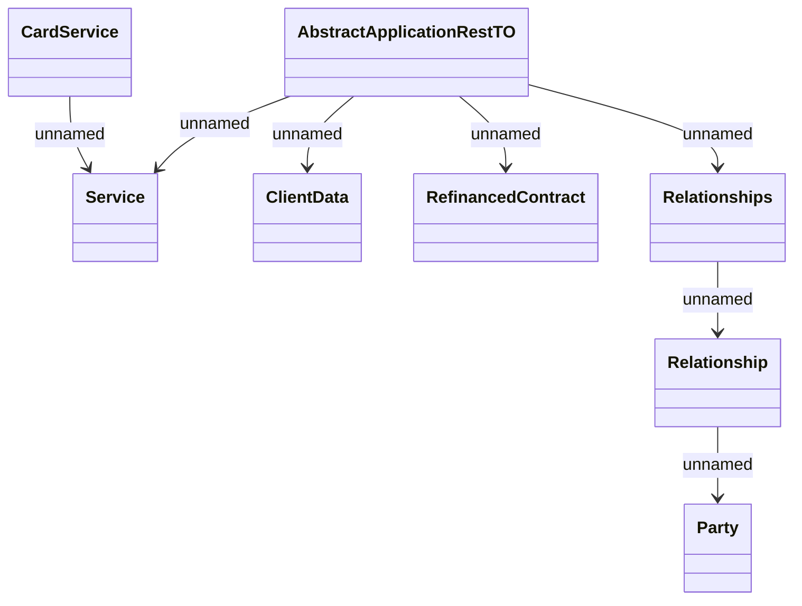

# Application

```mermaid
classDiagram
    class Relationships["Relationships"]
    class Party["Party"]
    class Relationship["Relationship"]
    class Service["Service"]
    class RefinancedContract["RefinancedContract"]
    class CardService["CardService"]
    class ClientData["ClientData"]
    class AbstractApplicationRestTO["AbstractApplicationRestTO"]
    AbstractApplicationRestTO --> Service : unnamed
    AbstractApplicationRestTO --> ClientData : unnamed
    AbstractApplicationRestTO --> RefinancedContract : unnamed
    AbstractApplicationRestTO --> Relationships : unnamed
    CardService --> Service : unnamed
    Relationship --> Party : unnamed
    Relationships --> Relationship : unnamed
```
