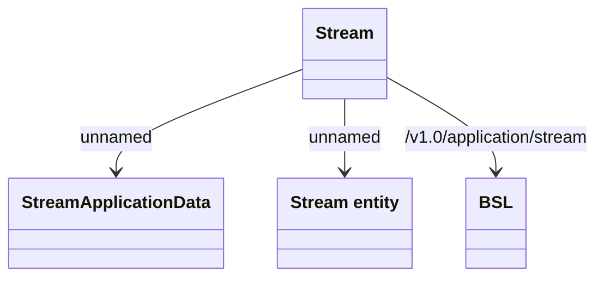

# Application Rest - Entity streaming

```mermaid
classDiagram
    class Stream_entity["Stream entity"]
    class StreamApplicationData["StreamApplicationData"]
    class Stream["Stream"]
    class BSL["BSL"]
    Stream --> StreamApplicationData : unnamed
    Stream --> Stream_entity : unnamed
    Stream --> BSL : /v1.0/application/stream
```
