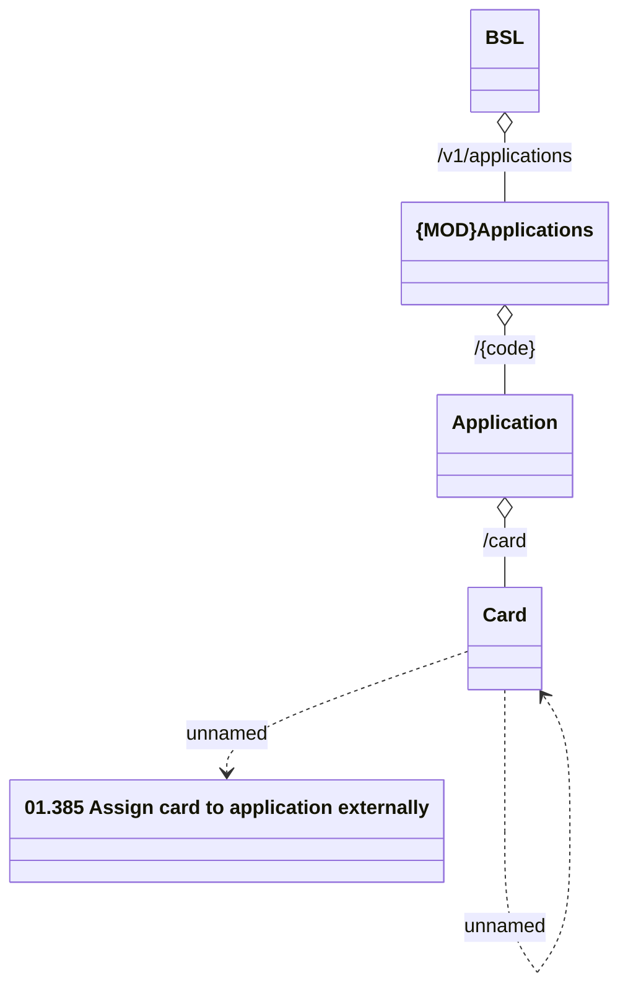

# Card operation

- **Diagram Type**: Logical
- **Package**: HomerSelect/BSL/Analysis Model/_Interface/Provided Web Services/Application/Application Rest/Management
- **Diagram ID**: 163837
- **Elements**: 6
- **Connectors**: 5

