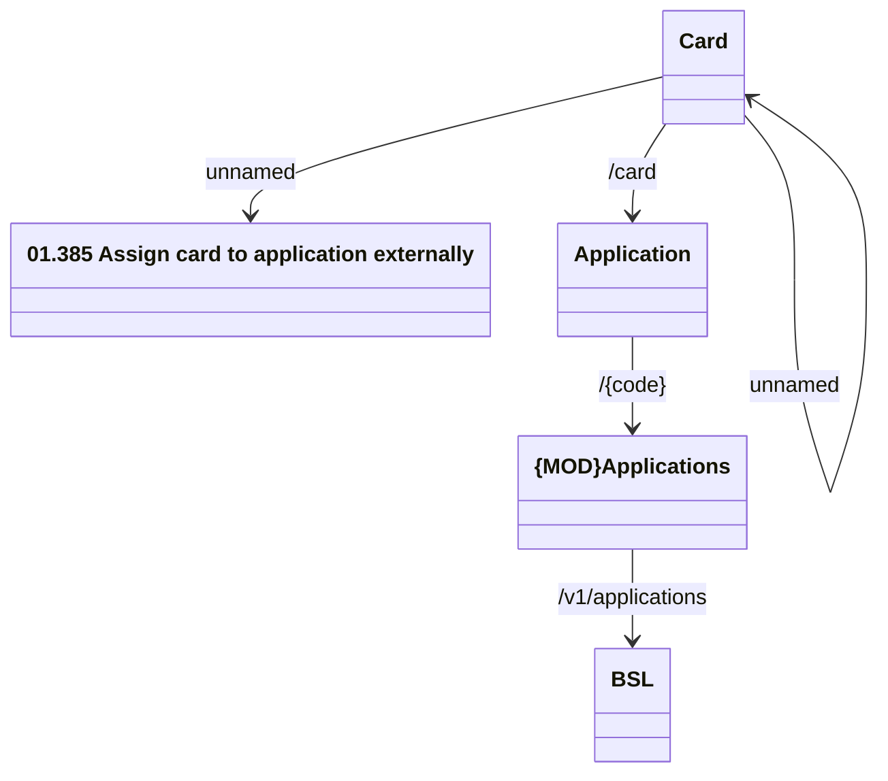

# Card operation

```mermaid
classDiagram
    class MOD_Applications["{MOD}Applications"]
    class n_01_385_Assign_card_to_application_externally["01.385 Assign card to application externally"]
    class Card["Card"]
    class Card["Card"]
    class Application["Application"]
    class BSL["BSL"]
    MOD_Applications --> BSL : /v1/applications
    Card --> Application : /card
    Card --> Card : unnamed
    Card --> n_01_385_Assign_card_to_application_externally : unnamed
    Application --> MOD_Applications : /{code}
```
