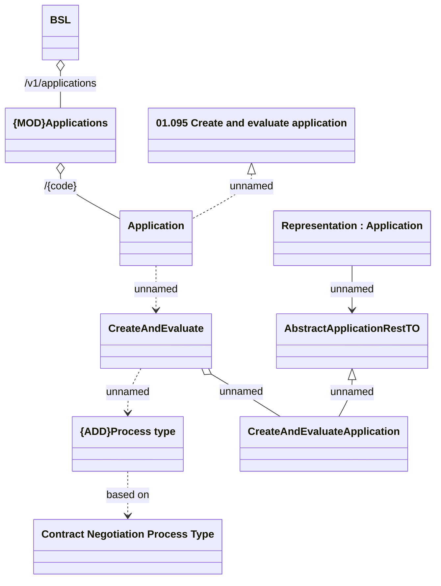

# Create

- **Diagram Type**: Logical
- **Package**: HomerSelect/BSL/Analysis Model/_Interface/Provided Web Services/Application/Application Rest/Management
- **Diagram ID**: 163838
- **Elements**: 10
- **Connectors**: 9

