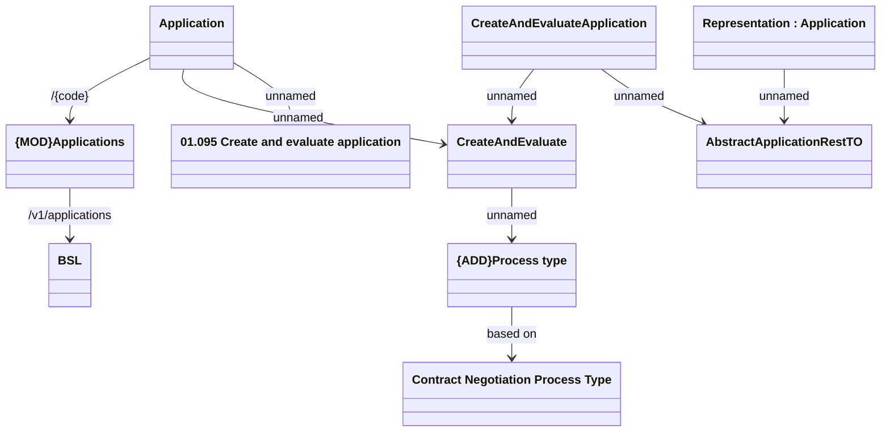

# Create

```mermaid
classDiagram
    class Contract_Negotiation_Process_Type["Contract Negotiation Process Type"]
    class ADD_Process_type["{ADD}Process type"]
    class MOD_Applications["{MOD}Applications"]
    class CreateAndEvaluate["CreateAndEvaluate"]
    class Representation_Application["Representation : Application"]
    class CreateAndEvaluateApplication["CreateAndEvaluateApplication"]
    class n_01_095_Create_and_evaluate_application["01.095 Create and evaluate application"]
    class AbstractApplicationRestTO["AbstractApplicationRestTO"]
    class Application["Application"]
    class BSL["BSL"]
    CreateAndEvaluate --> ADD_Process_type : unnamed
    MOD_Applications --> BSL : /v1/applications
    CreateAndEvaluateApplication --> AbstractApplicationRestTO : unnamed
    Representation_Application --> AbstractApplicationRestTO : unnamed
    Application --> n_01_095_Create_and_evaluate_application : unnamed
    Application --> CreateAndEvaluate : unnamed
    CreateAndEvaluateApplication --> CreateAndEvaluate : unnamed
    Application --> MOD_Applications : /{code}
    ADD_Process_type --> Contract_Negotiation_Process_Type : based on
```
