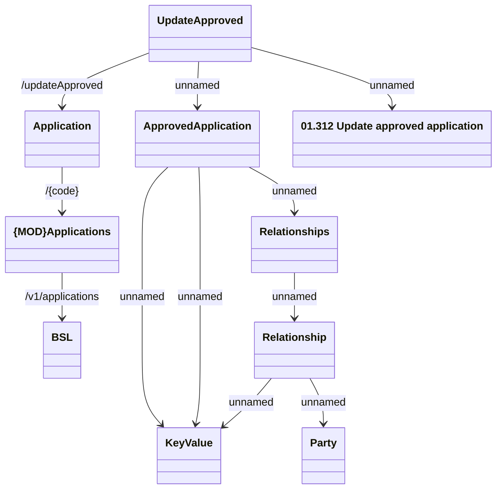

# UpdateApproved

```mermaid
classDiagram
    class MOD_Applications["{MOD}Applications"]
    class Party["Party"]
    class Relationship["Relationship"]
    class Relationships["Relationships"]
    class KeyValue["KeyValue"]
    class n_01_312_Update_approved_application["01.312 Update approved application"]
    class ApprovedApplication["ApprovedApplication"]
    class UpdateApproved["UpdateApproved"]
    class Application["Application"]
    class BSL["BSL"]
    MOD_Applications --> BSL : /v1/applications
    UpdateApproved --> Application : /updateApproved
    UpdateApproved --> ApprovedApplication : unnamed
    UpdateApproved --> n_01_312_Update_approved_application : unnamed
    Relationship --> KeyValue : unnamed
    ApprovedApplication --> KeyValue : unnamed
    ApprovedApplication --> KeyValue : unnamed
    ApprovedApplication --> Relationships : unnamed
    Relationships --> Relationship : unnamed
    Relationship --> Party : unnamed
    Application --> MOD_Applications : /{code}
```
