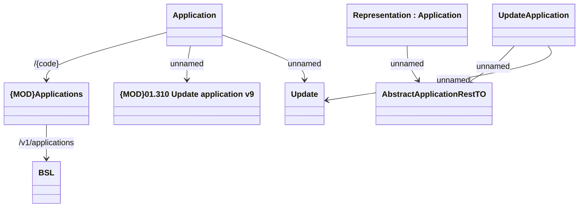

# Update

```mermaid
classDiagram
    class MOD_Applications["{MOD}Applications"]
    class MOD_01_310_Update_application_v9["{MOD}01.310 Update application v9"]
    class Representation_Application["Representation : Application"]
    class AbstractApplicationRestTO["AbstractApplicationRestTO"]
    class Update["Update"]
    class UpdateApplication["UpdateApplication"]
    class BSL["BSL"]
    class Application["Application"]
    MOD_Applications --> BSL : /v1/applications
    UpdateApplication --> Update : unnamed
    Application --> Update : unnamed
    Representation_Application --> AbstractApplicationRestTO : unnamed
    UpdateApplication --> AbstractApplicationRestTO : unnamed
    Application --> MOD_01_310_Update_application_v9 : unnamed
    Application --> MOD_Applications : /{code}
```
