# Application

- **Diagram Type**: Logical
- **Package**: HomerSelect/BSL/Analysis Model/_Interface/Provided Web Services/Application/ApplicationManagementWS/ApplicationManagementWS_v22/Types
- **Diagram ID**: 158253
- **Elements**: 30
- **Connectors**: 33

```mermaid
classDiagram
    class DocumentRelationType["DocumentRelationType"]
    class ExtendedProperties["ExtendedProperties"]
    class ExtendedProperty["ExtendedProperty"]
    class RefinancedContractBase["RefinancedContractBase"]
    class PersonCustomAttribute["PersonCustomAttribute"]
    class ClientAddressType["ClientAddressType"]
    class ExternalIdentificationAttributes["ExternalIdentificationAttributes"]
    class Remittance_Data["Remittance Data"]
    class SecurityQuestion["SecurityQuestion"]
    class CardService["CardService"]
    class ExtendedInformation["ExtendedInformation"]
    class Account_Type["Account Type"]
    class MOD_PaymentChannel["{MOD}PaymentChannel"]
    class PersonAddress["PersonAddress"]
    class PersonAddressType["PersonAddressType"]
    class ContactRole["ContactRole"]
    class Person["Person"]
    class Address["Address"]
    class ClientAddress["ClientAddress"]
    class Contact["Contact"]
    class Language["Language"]
    class InsuranceCustomData["InsuranceCustomData"]
    class InsuranceService["InsuranceService"]
    class Service["Service"]
    class userStatistics["userStatistics"]
    class Commodity["Commodity"]
    class Employment["Employment"]
    class Document["Document"]
    class Application["Application"]
    Person ..> Remittance_Data : unnamed
    PersonAddress ..> PersonAddressType : unnamed
    Person ..> PersonAddress : unnamed
    Application ..> MOD_PaymentChannel : unnamed
    Application ..> MOD_PaymentChannel : unnamed
    MOD_PaymentChannel ..> Account_Type : unnamed
    Document ..> DocumentRelationType : unnamed
    Application ..> SecurityQuestion : unnamed
    PersonAddress ..> Address : unnamed
    Application ..> ExternalIdentificationAttributes : unnamed
    ClientAddress ..> ClientAddressType : unnamed
    Application ..> PersonCustomAttribute : unnamed
    Application ..> RefinancedContractBase : unnamed
    ExtendedProperties ..> ExtendedProperty : unnamed
    Application ..> ExtendedProperties : unnamed
    Application ..> ExtendedInformation : unnamed
    Application ..> Contact : unnamed
    Application ..> Employment : unnamed
    Application ..> Commodity : unnamed
    Application ..> userStatistics : unnamed
    Application ..> Service : unnamed
    Service <|-- CardService : unnamed
    Service <|-- InsuranceService : unnamed
    Contact ..> ContactRole : unnamed
    Application ..> Language : unnamed
    Application ..> Person : unnamed
    Employment ..> Contact : unnamed
    Person ..> Contact : unnamed
    Application ..> ClientAddress : unnamed
    Employment ..> Address : unnamed
    ClientAddress ..> Address : unnamed
    Application ..> Document : unnamed
    InsuranceService ..> InsuranceCustomData : unnamed
```

