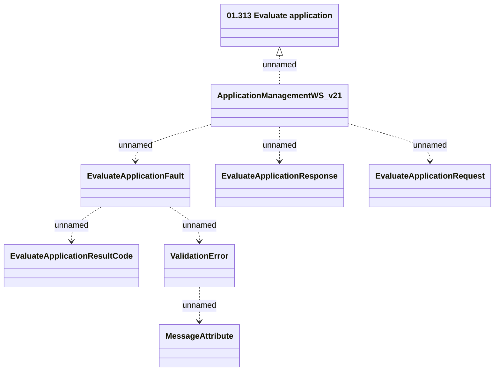

# ApplicationManagementWS_v21 - EvaluateApplication

- **Diagram Type**: Logical
- **Package**: HomerSelect/BSL/Analysis Model/_Interface/Provided Web Services/Application/ApplicationManagementWS/ApplicationManagementWS_v21
- **Diagram ID**: 158288
- **Elements**: 8
- **Connectors**: 7

