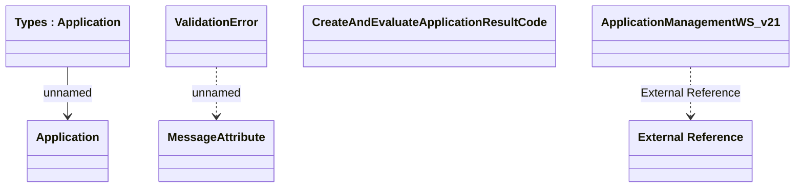

# ApplicationManagementWS_v21 - InitiateEvaluation

- **Diagram Type**: Logical
- **Package**: HomerSelect/BSL/Analysis Model/_Interface/Provided Web Services/Application/ApplicationManagementWS/ApplicationManagementWS_v21
- **Diagram ID**: 158285
- **Elements**: 7
- **Connectors**: 3

