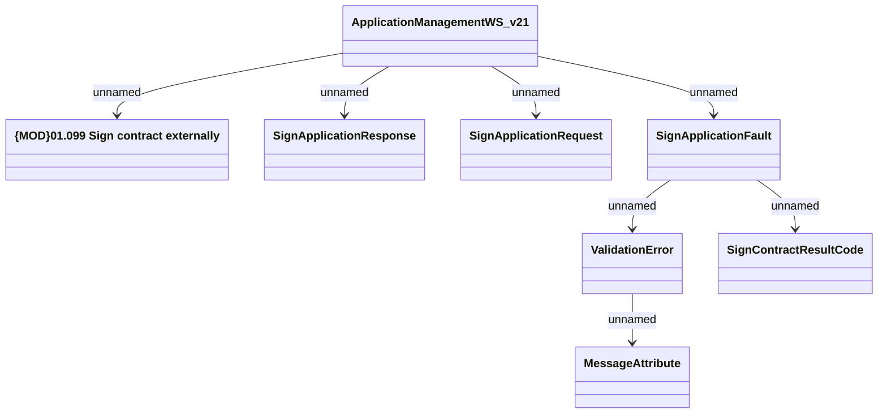

# ApplicationManagementWS_v21 - SignApplication

```mermaid
classDiagram
    class MOD_01_099_Sign_contract_externally["{MOD}01.099 Sign contract externally"]
    class MessageAttribute["MessageAttribute"]
    class ValidationError["ValidationError"]
    class SignContractResultCode["SignContractResultCode"]
    class SignApplicationResponse["SignApplicationResponse"]
    class SignApplicationRequest["SignApplicationRequest"]
    class SignApplicationFault["SignApplicationFault"]
    class ApplicationManagementWS_v21["ApplicationManagementWS_v21"]
    ApplicationManagementWS_v21 --> SignApplicationFault : unnamed
    ApplicationManagementWS_v21 --> SignApplicationRequest : unnamed
    ApplicationManagementWS_v21 --> SignApplicationResponse : unnamed
    SignApplicationFault --> SignContractResultCode : unnamed
    SignApplicationFault --> ValidationError : unnamed
    ValidationError --> MessageAttribute : unnamed
    ApplicationManagementWS_v21 --> MOD_01_099_Sign_contract_externally : unnamed
```
