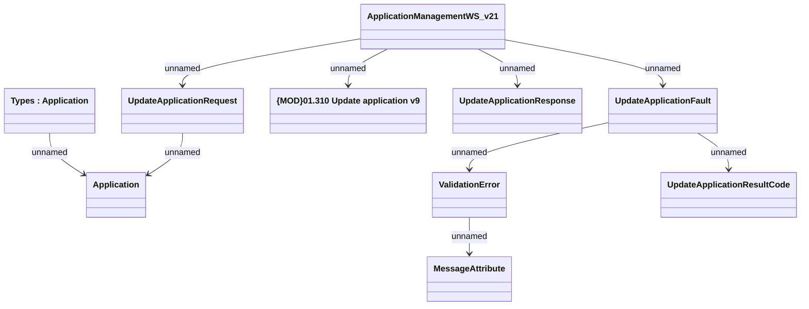

# ApplicationManagementWS_v21 - UpdateApplication

```mermaid
classDiagram
    class Types_Application["Types : Application"]
    class UpdateApplicationResultCode["UpdateApplicationResultCode"]
    class UpdateApplicationFault["UpdateApplicationFault"]
    class UpdateApplicationResponse["UpdateApplicationResponse"]
    class Application["Application"]
    class MOD_01_310_Update_application_v9["{MOD}01.310 Update application v9"]
    class UpdateApplicationRequest["UpdateApplicationRequest"]
    class MessageAttribute["MessageAttribute"]
    class ValidationError["ValidationError"]
    class ApplicationManagementWS_v21["ApplicationManagementWS_v21"]
    UpdateApplicationFault --> ValidationError : unnamed
    ValidationError --> MessageAttribute : unnamed
    ApplicationManagementWS_v21 --> UpdateApplicationRequest : unnamed
    ApplicationManagementWS_v21 --> MOD_01_310_Update_application_v9 : unnamed
    UpdateApplicationRequest --> Application : unnamed
    Types_Application --> Application : unnamed
    ApplicationManagementWS_v21 --> UpdateApplicationResponse : unnamed
    ApplicationManagementWS_v21 --> UpdateApplicationFault : unnamed
    UpdateApplicationFault --> UpdateApplicationResultCode : unnamed
```
