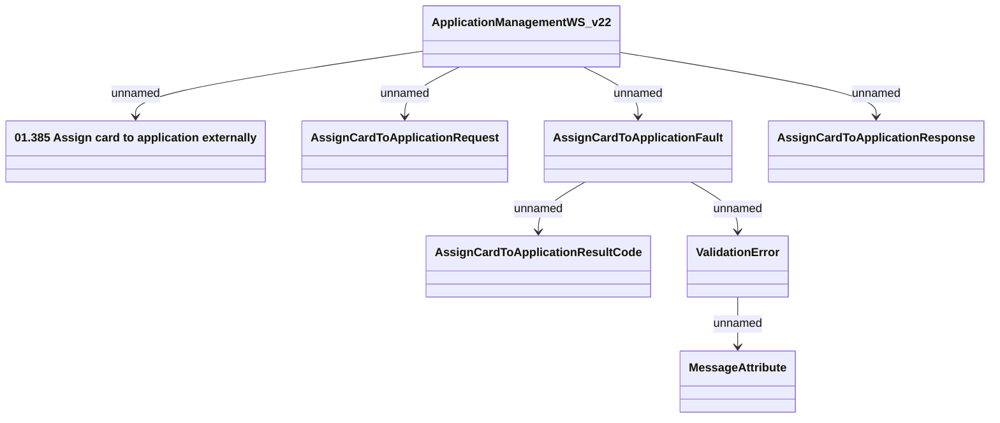

# ApplicationManagementWS_v22 - AssignCardToApplication

```mermaid
classDiagram
    class n_01_385_Assign_card_to_application_externally["01.385 Assign card to application externally"]
    class AssignCardToApplicationRequest["AssignCardToApplicationRequest"]
    class AssignCardToApplicationResultCode["AssignCardToApplicationResultCode"]
    class MessageAttribute["MessageAttribute"]
    class ValidationError["ValidationError"]
    class AssignCardToApplicationFault["AssignCardToApplicationFault"]
    class AssignCardToApplicationResponse["AssignCardToApplicationResponse"]
    class ApplicationManagementWS_v22["ApplicationManagementWS_v22"]
    ApplicationManagementWS_v22 --> AssignCardToApplicationResponse : unnamed
    ApplicationManagementWS_v22 --> AssignCardToApplicationFault : unnamed
    AssignCardToApplicationFault --> ValidationError : unnamed
    ValidationError --> MessageAttribute : unnamed
    AssignCardToApplicationFault --> AssignCardToApplicationResultCode : unnamed
    ApplicationManagementWS_v22 --> AssignCardToApplicationRequest : unnamed
    ApplicationManagementWS_v22 --> n_01_385_Assign_card_to_application_externally : unnamed
```
