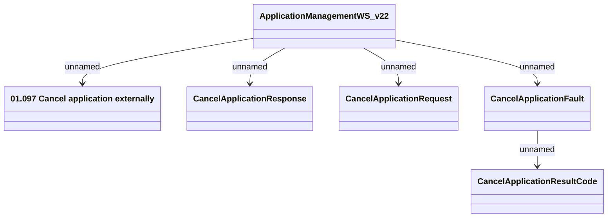

# ApplicationManagementWS_v22 - CancelApplication

```mermaid
classDiagram
    class n_01_097_Cancel_application_externally["01.097 Cancel application externally"]
    class CancelApplicationResultCode["CancelApplicationResultCode"]
    class CancelApplicationResponse["CancelApplicationResponse"]
    class CancelApplicationRequest["CancelApplicationRequest"]
    class CancelApplicationFault["CancelApplicationFault"]
    class ApplicationManagementWS_v22["ApplicationManagementWS_v22"]
    ApplicationManagementWS_v22 --> CancelApplicationFault : unnamed
    ApplicationManagementWS_v22 --> CancelApplicationRequest : unnamed
    ApplicationManagementWS_v22 --> CancelApplicationResponse : unnamed
    CancelApplicationFault --> CancelApplicationResultCode : unnamed
    ApplicationManagementWS_v22 --> n_01_097_Cancel_application_externally : unnamed
```
