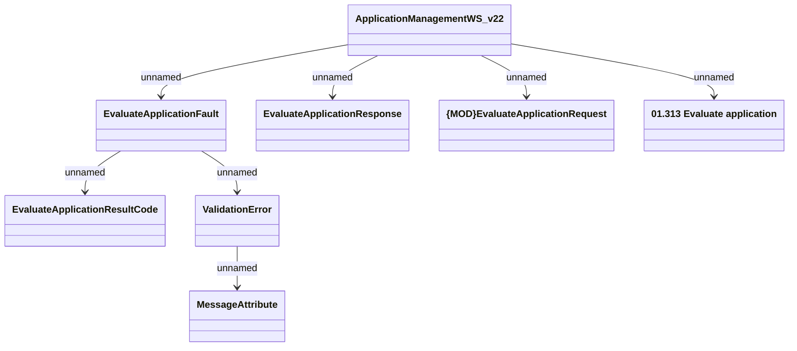

# ApplicationManagementWS_v22 - EvaluateApplication

```mermaid
classDiagram
    class EvaluateApplicationResultCode["EvaluateApplicationResultCode"]
    class MessageAttribute["MessageAttribute"]
    class ValidationError["ValidationError"]
    class EvaluateApplicationFault["EvaluateApplicationFault"]
    class EvaluateApplicationResponse["EvaluateApplicationResponse"]
    class MOD_EvaluateApplicationRequest["{MOD}EvaluateApplicationRequest"]
    class n_01_313_Evaluate_application["01.313 Evaluate application"]
    class ApplicationManagementWS_v22["ApplicationManagementWS_v22"]
    ApplicationManagementWS_v22 --> n_01_313_Evaluate_application : unnamed
    ApplicationManagementWS_v22 --> MOD_EvaluateApplicationRequest : unnamed
    ApplicationManagementWS_v22 --> EvaluateApplicationResponse : unnamed
    ApplicationManagementWS_v22 --> EvaluateApplicationFault : unnamed
    EvaluateApplicationFault --> ValidationError : unnamed
    ValidationError --> MessageAttribute : unnamed
    EvaluateApplicationFault --> EvaluateApplicationResultCode : unnamed
```
