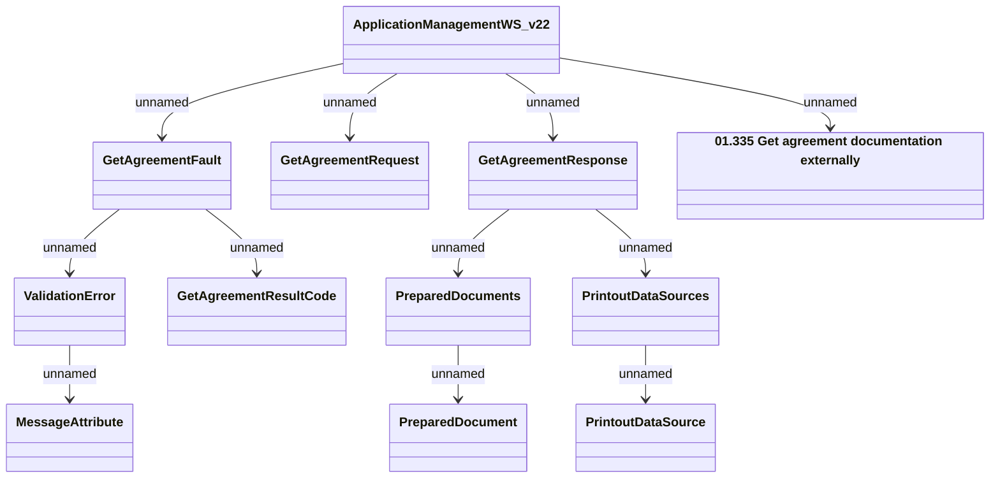

# ApplicationManagementWS_v22 - GetAgreement

```mermaid
classDiagram
    class MessageAttribute["MessageAttribute"]
    class ValidationError["ValidationError"]
    class GetAgreementResultCode["GetAgreementResultCode"]
    class PreparedDocument["PreparedDocument"]
    class PrintoutDataSource["PrintoutDataSource"]
    class PrintoutDataSources["PrintoutDataSources"]
    class PreparedDocuments["PreparedDocuments"]
    class GetAgreementResponse["GetAgreementResponse"]
    class GetAgreementRequest["GetAgreementRequest"]
    class GetAgreementFault["GetAgreementFault"]
    class n_01_335_Get_agreement_documentation_externally["01.335 Get agreement documentation externally"]
    class ApplicationManagementWS_v22["ApplicationManagementWS_v22"]
    ApplicationManagementWS_v22 --> n_01_335_Get_agreement_documentation_externally : unnamed
    ApplicationManagementWS_v22 --> GetAgreementFault : unnamed
    ApplicationManagementWS_v22 --> GetAgreementRequest : unnamed
    ApplicationManagementWS_v22 --> GetAgreementResponse : unnamed
    GetAgreementResponse --> PreparedDocuments : unnamed
    GetAgreementResponse --> PrintoutDataSources : unnamed
    PrintoutDataSources --> PrintoutDataSource : unnamed
    PreparedDocuments --> PreparedDocument : unnamed
    GetAgreementFault --> GetAgreementResultCode : unnamed
    GetAgreementFault --> ValidationError : unnamed
    ValidationError --> MessageAttribute : unnamed
```
