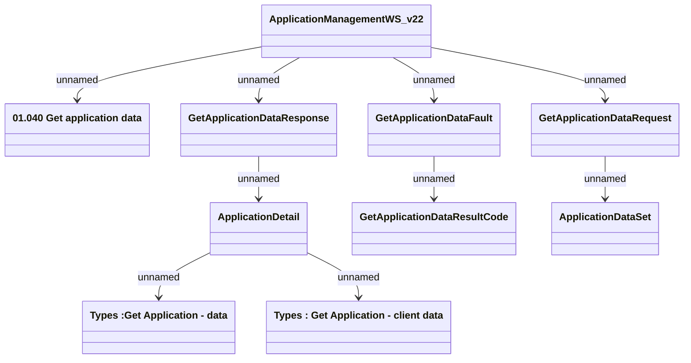

# ApplicationManagementWS_v22 - GetApplicationData

```mermaid
classDiagram
    class Types_Get_Application_client_data["Types : Get Application - client data"]
    class Types_Get_Application_data["Types :Get Application - data"]
    class n_01_040_Get_application_data["01.040 Get application data"]
    class ApplicationDetail["ApplicationDetail"]
    class GetApplicationDataResultCode["GetApplicationDataResultCode"]
    class ApplicationDataSet["ApplicationDataSet"]
    class GetApplicationDataResponse["GetApplicationDataResponse"]
    class GetApplicationDataRequest["GetApplicationDataRequest"]
    class GetApplicationDataFault["GetApplicationDataFault"]
    class ApplicationManagementWS_v22["ApplicationManagementWS_v22"]
    ApplicationManagementWS_v22 --> GetApplicationDataFault : unnamed
    ApplicationManagementWS_v22 --> GetApplicationDataRequest : unnamed
    ApplicationManagementWS_v22 --> GetApplicationDataResponse : unnamed
    GetApplicationDataRequest --> ApplicationDataSet : unnamed
    GetApplicationDataFault --> GetApplicationDataResultCode : unnamed
    GetApplicationDataResponse --> ApplicationDetail : unnamed
    ApplicationManagementWS_v22 --> n_01_040_Get_application_data : unnamed
    ApplicationDetail --> Types_Get_Application_data : unnamed
    ApplicationDetail --> Types_Get_Application_client_data : unnamed
```
