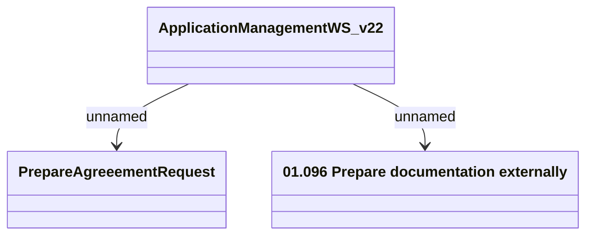

# ApplicationManagementWS_v22 - PrepareAgreeement

```mermaid
classDiagram
    class n_01_096_Prepare_documentation_externally["01.096 Prepare documentation externally"]
    class PrepareAgreeementRequest["PrepareAgreeementRequest"]
    class ApplicationManagementWS_v22["ApplicationManagementWS_v22"]
    ApplicationManagementWS_v22 --> PrepareAgreeementRequest : unnamed
    ApplicationManagementWS_v22 --> n_01_096_Prepare_documentation_externally : unnamed
```
