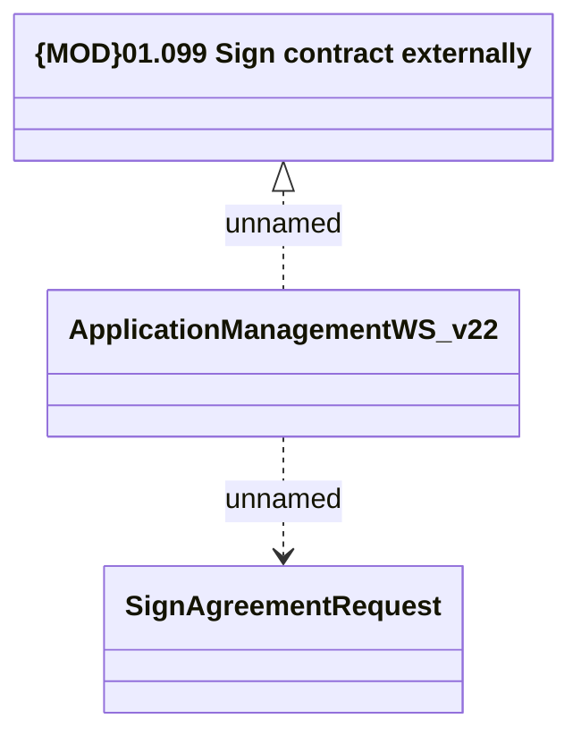

# ApplicationManagementWS_v22 - SignAgreement

- **Diagram Type**: Logical
- **Package**: HomerSelect/BSL/Analysis Model/_Interface/Provided Web Services/Application/ApplicationManagementWS/ApplicationManagementWS_v22
- **Diagram ID**: 158236
- **Elements**: 3
- **Connectors**: 2

