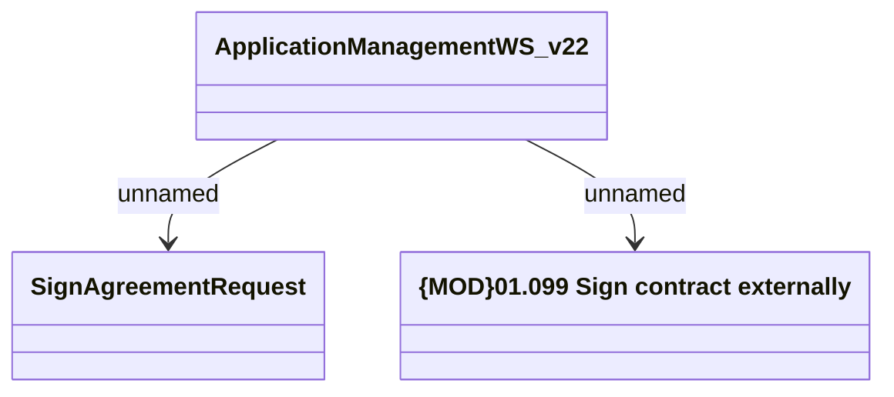

# ApplicationManagementWS_v22 - SignAgreement

```mermaid
classDiagram
    class MOD_01_099_Sign_contract_externally["{MOD}01.099 Sign contract externally"]
    class SignAgreementRequest["SignAgreementRequest"]
    class ApplicationManagementWS_v22["ApplicationManagementWS_v22"]
    ApplicationManagementWS_v22 --> SignAgreementRequest : unnamed
    ApplicationManagementWS_v22 --> MOD_01_099_Sign_contract_externally : unnamed
```
