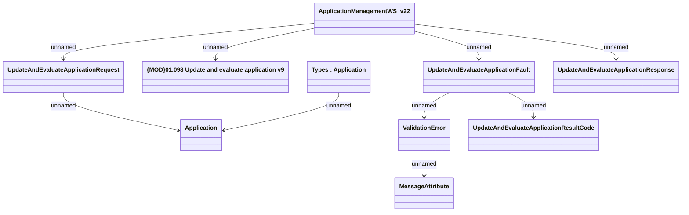

# ApplicationManagementWS_v22 - UpdateAndEvaluateApplication

```mermaid
classDiagram
    class Types_Application["Types : Application"]
    class MOD_01_098_Update_and_evaluate_application_v9["{MOD}01.098 Update and evaluate application v9"]
    class Application["Application"]
    class UpdateAndEvaluateApplicationRequest["UpdateAndEvaluateApplicationRequest"]
    class MessageAttribute["MessageAttribute"]
    class ValidationError["ValidationError"]
    class UpdateAndEvaluateApplicationResultCode["UpdateAndEvaluateApplicationResultCode"]
    class UpdateAndEvaluateApplicationFault["UpdateAndEvaluateApplicationFault"]
    class UpdateAndEvaluateApplicationResponse["UpdateAndEvaluateApplicationResponse"]
    class ApplicationManagementWS_v22["ApplicationManagementWS_v22"]
    ApplicationManagementWS_v22 --> UpdateAndEvaluateApplicationResponse : unnamed
    ApplicationManagementWS_v22 --> UpdateAndEvaluateApplicationFault : unnamed
    UpdateAndEvaluateApplicationFault --> UpdateAndEvaluateApplicationResultCode : unnamed
    UpdateAndEvaluateApplicationFault --> ValidationError : unnamed
    ValidationError --> MessageAttribute : unnamed
    ApplicationManagementWS_v22 --> UpdateAndEvaluateApplicationRequest : unnamed
    UpdateAndEvaluateApplicationRequest --> Application : unnamed
    Types_Application --> Application : unnamed
    ApplicationManagementWS_v22 --> MOD_01_098_Update_and_evaluate_application_v9 : unnamed
```
