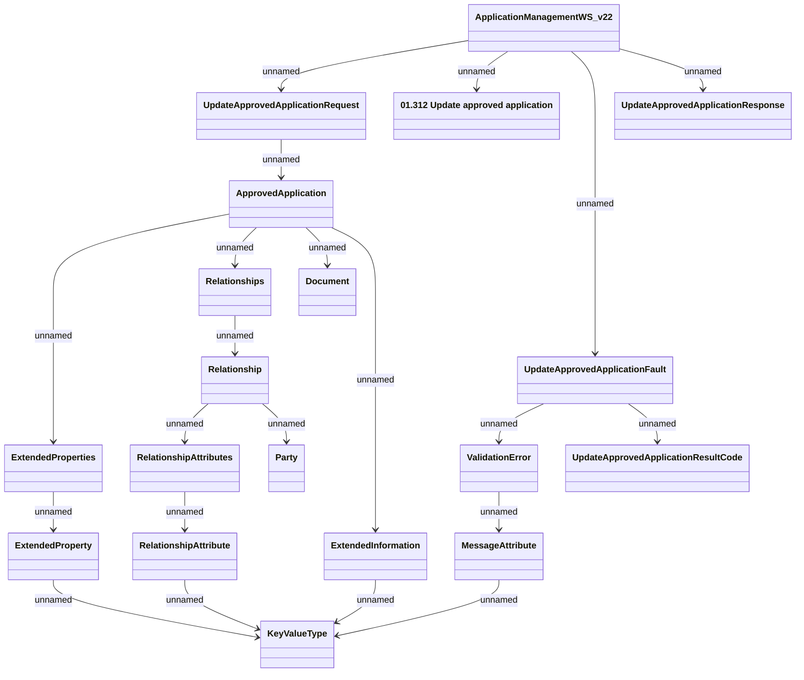

# ApplicationManagementWS_v22 - UpdateApprovedApplication

```mermaid
classDiagram
    class Document["Document"]
    class ExtendedProperties["ExtendedProperties"]
    class ExtendedProperty["ExtendedProperty"]
    class RelationshipAttribute["RelationshipAttribute"]
    class RelationshipAttributes["RelationshipAttributes"]
    class Relationship["Relationship"]
    class Relationships["Relationships"]
    class Party["Party"]
    class ApprovedApplication["ApprovedApplication"]
    class KeyValueType["KeyValueType"]
    class n_01_312_Update_approved_application["01.312 Update approved application"]
    class ExtendedInformation["ExtendedInformation"]
    class MessageAttribute["MessageAttribute"]
    class ValidationError["ValidationError"]
    class UpdateApprovedApplicationResultCode["UpdateApprovedApplicationResultCode"]
    class UpdateApprovedApplicationFault["UpdateApprovedApplicationFault"]
    class UpdateApprovedApplicationResponse["UpdateApprovedApplicationResponse"]
    class UpdateApprovedApplicationRequest["UpdateApprovedApplicationRequest"]
    class ApplicationManagementWS_v22["ApplicationManagementWS_v22"]
    MessageAttribute --> KeyValueType : unnamed
    ApprovedApplication --> ExtendedProperties : unnamed
    ExtendedProperties --> ExtendedProperty : unnamed
    RelationshipAttributes --> RelationshipAttribute : unnamed
    Relationship --> RelationshipAttributes : unnamed
    Relationships --> Relationship : unnamed
    ApprovedApplication --> Relationships : unnamed
    Relationship --> Party : unnamed
    UpdateApprovedApplicationRequest --> ApprovedApplication : unnamed
    ApprovedApplication --> Document : unnamed
    RelationshipAttribute --> KeyValueType : unnamed
    ApplicationManagementWS_v22 --> UpdateApprovedApplicationRequest : unnamed
    ExtendedInformation --> KeyValueType : unnamed
    ApplicationManagementWS_v22 --> n_01_312_Update_approved_application : unnamed
    ApprovedApplication --> ExtendedInformation : unnamed
    ValidationError --> MessageAttribute : unnamed
    UpdateApprovedApplicationFault --> ValidationError : unnamed
    UpdateApprovedApplicationFault --> UpdateApprovedApplicationResultCode : unnamed
    ApplicationManagementWS_v22 --> UpdateApprovedApplicationFault : unnamed
    ApplicationManagementWS_v22 --> UpdateApprovedApplicationResponse : unnamed
    ExtendedProperty --> KeyValueType : unnamed
```
