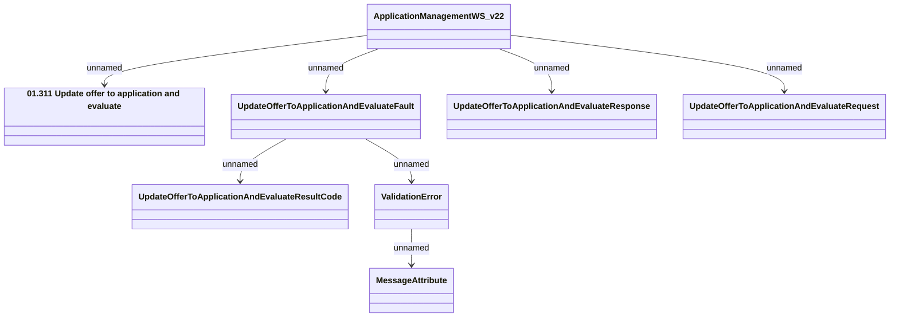

# ApplicationManagementWS_v22 - UpdateOfferToApplicationAndEvaluate

```mermaid
classDiagram
    class n_01_311_Update_offer_to_application_and_evaluate["01.311 Update offer to application and evaluate"]
    class UpdateOfferToApplicationAndEvaluateResultCode["UpdateOfferToApplicationAndEvaluateResultCode"]
    class UpdateOfferToApplicationAndEvaluateFault["UpdateOfferToApplicationAndEvaluateFault"]
    class UpdateOfferToApplicationAndEvaluateResponse["UpdateOfferToApplicationAndEvaluateResponse"]
    class UpdateOfferToApplicationAndEvaluateRequest["UpdateOfferToApplicationAndEvaluateRequest"]
    class MessageAttribute["MessageAttribute"]
    class ValidationError["ValidationError"]
    class ApplicationManagementWS_v22["ApplicationManagementWS_v22"]
    UpdateOfferToApplicationAndEvaluateFault --> ValidationError : unnamed
    ValidationError --> MessageAttribute : unnamed
    ApplicationManagementWS_v22 --> UpdateOfferToApplicationAndEvaluateRequest : unnamed
    ApplicationManagementWS_v22 --> UpdateOfferToApplicationAndEvaluateResponse : unnamed
    ApplicationManagementWS_v22 --> UpdateOfferToApplicationAndEvaluateFault : unnamed
    UpdateOfferToApplicationAndEvaluateFault --> UpdateOfferToApplicationAndEvaluateResultCode : unnamed
    ApplicationManagementWS_v22 --> n_01_311_Update_offer_to_application_and_evaluate : unnamed
```
