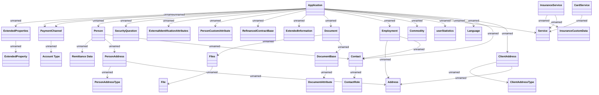

# Application

```mermaid
classDiagram
    class ExtendedProperties["ExtendedProperties"]
    class ExtendedProperty["ExtendedProperty"]
    class Files["Files"]
    class File["File"]
    class RefinancedContractBase["RefinancedContractBase"]
    class PersonCustomAttribute["PersonCustomAttribute"]
    class ClientAddressType["ClientAddressType"]
    class ExternalIdentificationAttributes["ExternalIdentificationAttributes"]
    class Remittance_Data["Remittance Data"]
    class SecurityQuestion["SecurityQuestion"]
    class CardService["CardService"]
    class ExtendedInformation["ExtendedInformation"]
    class Account_Type["Account Type"]
    class PaymentChannel["PaymentChannel"]
    class PersonAddress["PersonAddress"]
    class PersonAddressType["PersonAddressType"]
    class ContactRole["ContactRole"]
    class Person["Person"]
    class Address["Address"]
    class ClientAddress["ClientAddress"]
    class Contact["Contact"]
    class Language["Language"]
    class InsuranceCustomData["InsuranceCustomData"]
    class InsuranceService["InsuranceService"]
    class Service["Service"]
    class userStatistics["userStatistics"]
    class Commodity["Commodity"]
    class Employment["Employment"]
    class Document["Document"]
    class DocumentBase["DocumentBase"]
    class DocumentAttribute["DocumentAttribute"]
    class Application["Application"]
    Person --> Remittance_Data : unnamed
    Application --> ExtendedProperties : unnamed
    PersonAddress --> PersonAddressType : unnamed
    Person --> PersonAddress : unnamed
    Application --> PaymentChannel : unnamed
    Application --> PaymentChannel : unnamed
    PaymentChannel --> Account_Type : unnamed
    Application --> Person : unnamed
    Application --> SecurityQuestion : unnamed
    Employment --> Address : unnamed
    Application --> ExternalIdentificationAttributes : unnamed
    ClientAddress --> ClientAddressType : unnamed
    Application --> PersonCustomAttribute : unnamed
    Application --> RefinancedContractBase : unnamed
    Document --> Files : unnamed
    ExtendedProperties --> ExtendedProperty : unnamed
    Application --> ExtendedInformation : unnamed
    InsuranceService --> InsuranceCustomData : unnamed
    Document --> DocumentBase : unnamed
    Application --> Document : unnamed
    Application --> Employment : unnamed
    Application --> Commodity : unnamed
    Application --> userStatistics : unnamed
    Application --> Service : unnamed
    Contact --> ContactRole : unnamed
    InsuranceService --> Service : unnamed
    DocumentBase --> DocumentAttribute : unnamed
    Application --> Language : unnamed
    Application --> Contact : unnamed
    Employment --> Contact : unnamed
    Person --> Contact : unnamed
    Application --> ClientAddress : unnamed
    PersonAddress --> Address : unnamed
    ClientAddress --> Address : unnamed
    CardService --> Service : unnamed
    Files --> File : unnamed
```
