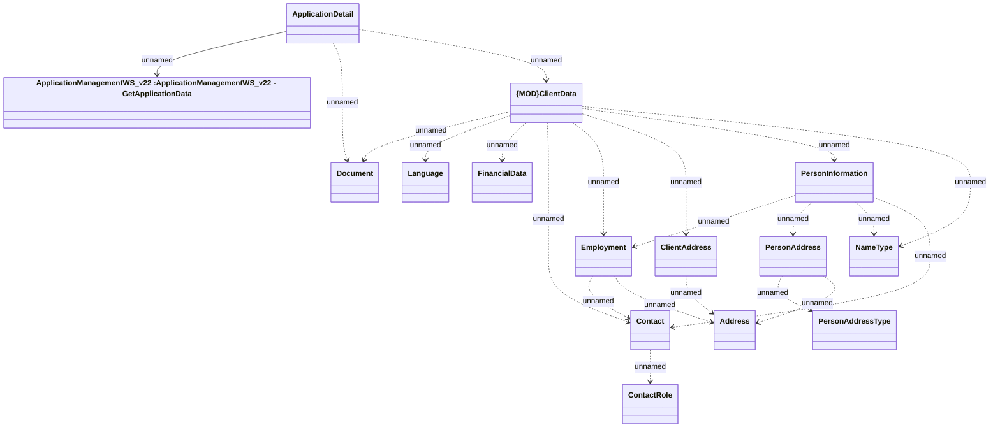

# Get Application - client data

- **Diagram Type**: Logical
- **Package**: HomerSelect/BSL/Analysis Model/_Interface/Provided Web Services/Application/ApplicationManagementWS/ApplicationManagementWS_v22/Types
- **Diagram ID**: 158252
- **Elements**: 15
- **Connectors**: 21

