# Get Application - data

- **Diagram Type**: Logical
- **Package**: HomerSelect/BSL/Analysis Model/_Interface/Provided Web Services/Application/ApplicationManagementWS/ApplicationManagementWS_v22/Types
- **Diagram ID**: 158254
- **Elements**: 27
- **Connectors**: 26

```mermaid
classDiagram
    class PaymentChannel["PaymentChannel"]
    class Document["Document"]
    class Offer["Offer"]
    class ExternalIdentificationAttributes["ExternalIdentificationAttributes"]
    class ChannelEventType["ChannelEventType"]
    class ApplicationManagementWS_v22_ApplicationManagementWS_v22_GetA["ApplicationManagementWS_v22 :ApplicationManagementWS_v22 - GetApplicationData"]
    class Commodity["Commodity"]
    class RefinancedContractBase["RefinancedContractBase"]
    class RefinancedContract["RefinancedContract"]
    class AdditionalInformation["AdditionalInformation"]
    class CardService["CardService"]
    class InsuranceCustomData["InsuranceCustomData"]
    class InsuranceService["InsuranceService"]
    class Service["Service"]
    class ExtendedProperty["ExtendedProperty"]
    class ScoringDataType["ScoringDataType"]
    class ApplicationEventType["ApplicationEventType"]
    class ApplicationEvent["ApplicationEvent"]
    class StatusHistory["StatusHistory"]
    class InstallmentItem["InstallmentItem"]
    class Installment["Installment"]
    class ApplicationDetail["ApplicationDetail"]
    class RelationshipAttribute["RelationshipAttribute"]
    class RelationshipAttributes["RelationshipAttributes"]
    class Relationship["Relationship"]
    class Relationships["Relationships"]
    class Party["Party"]
    Service <|-- InsuranceService : unnamed
    ApplicationDetail ..> Document : unnamed
    ApplicationDetail ..> Offer : unnamed
    ApplicationDetail ..> ExternalIdentificationAttributes : unnamed
    ApplicationEvent ..> ChannelEventType : unnamed
    ApplicationDetail --> ApplicationManagementWS_v22_ApplicationManagementWS_v22_GetA : unnamed
    ApplicationDetail ..> Commodity : unnamed
    RefinancedContractBase <|-- RefinancedContract : unnamed
    ApplicationDetail ..> RefinancedContract : unnamed
    ScoringDataType ..> AdditionalInformation : unnamed
    InsuranceService ..> InsuranceCustomData : unnamed
    ApplicationDetail ..> PaymentChannel : unnamed
    ApplicationDetail ..> Service : unnamed
    Relationship ..> Party : unnamed
    ApplicationDetail ..> ExtendedProperty : unnamed
    ApplicationDetail ..> ScoringDataType : unnamed
    ApplicationEvent ..> ApplicationEventType : unnamed
    ApplicationDetail ..> ApplicationEvent : unnamed
    ApplicationDetail ..> StatusHistory : unnamed
    Installment ..> InstallmentItem : unnamed
    ApplicationDetail ..> Installment : unnamed
    RelationshipAttributes ..> RelationshipAttribute : unnamed
    Relationship ..> RelationshipAttributes : unnamed
    Relationships ..> Relationship : unnamed
    ApplicationDetail ..> Relationships : unnamed
    Service <|-- CardService : unnamed
```

