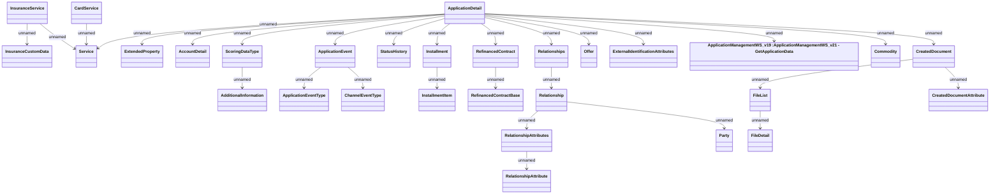

# Get Application - data

```mermaid
classDiagram
    class Offer["Offer"]
    class ExternalIdentificationAttributes["ExternalIdentificationAttributes"]
    class ChannelEventType["ChannelEventType"]
    class FileDetail["FileDetail"]
    class FileList["FileList"]
    class CreatedDocumentAttribute["CreatedDocumentAttribute"]
    class ApplicationManagementWS_v19_ApplicationManagementWS_v21_GetA["ApplicationManagementWS_v19 :ApplicationManagementWS_v21 - GetApplicationData"]
    class Commodity["Commodity"]
    class RefinancedContractBase["RefinancedContractBase"]
    class RefinancedContract["RefinancedContract"]
    class AdditionalInformation["AdditionalInformation"]
    class CardService["CardService"]
    class InsuranceCustomData["InsuranceCustomData"]
    class InsuranceService["InsuranceService"]
    class Service["Service"]
    class ExtendedProperty["ExtendedProperty"]
    class AccountDetail["AccountDetail"]
    class ScoringDataType["ScoringDataType"]
    class ApplicationEventType["ApplicationEventType"]
    class ApplicationEvent["ApplicationEvent"]
    class StatusHistory["StatusHistory"]
    class InstallmentItem["InstallmentItem"]
    class Installment["Installment"]
    class CreatedDocument["CreatedDocument"]
    class ApplicationDetail["ApplicationDetail"]
    class RelationshipAttribute["RelationshipAttribute"]
    class RelationshipAttributes["RelationshipAttributes"]
    class Relationship["Relationship"]
    class Relationships["Relationships"]
    class Party["Party"]
    Relationship --> RelationshipAttributes : unnamed
    InsuranceService --> InsuranceCustomData : unnamed
    ApplicationDetail --> Service : unnamed
    CardService --> Service : unnamed
    InsuranceService --> Service : unnamed
    ApplicationDetail --> ExtendedProperty : unnamed
    ApplicationDetail --> AccountDetail : unnamed
    ApplicationDetail --> ScoringDataType : unnamed
    ApplicationEvent --> ApplicationEventType : unnamed
    ApplicationDetail --> ApplicationEvent : unnamed
    ApplicationDetail --> StatusHistory : unnamed
    Installment --> InstallmentItem : unnamed
    ApplicationDetail --> Installment : unnamed
    ScoringDataType --> AdditionalInformation : unnamed
    RelationshipAttributes --> RelationshipAttribute : unnamed
    ApplicationDetail --> RefinancedContract : unnamed
    Relationships --> Relationship : unnamed
    ApplicationDetail --> Relationships : unnamed
    Relationship --> Party : unnamed
    ApplicationDetail --> Offer : unnamed
    ApplicationDetail --> ExternalIdentificationAttributes : unnamed
    ApplicationEvent --> ChannelEventType : unnamed
    FileList --> FileDetail : unnamed
    CreatedDocument --> FileList : unnamed
    CreatedDocument --> CreatedDocumentAttribute : unnamed
    ApplicationDetail --> ApplicationManagementWS_v19_ApplicationManagementWS_v21_GetA : unnamed
    ApplicationDetail --> Commodity : unnamed
    RefinancedContract --> RefinancedContractBase : unnamed
    ApplicationDetail --> CreatedDocument : unnamed
```
