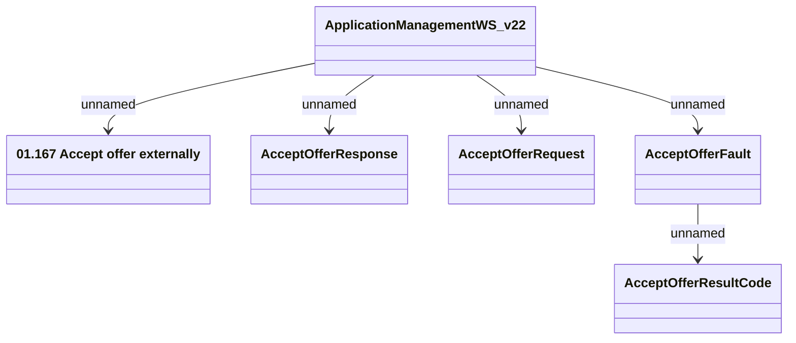

# {ADD}ApplicationManagementWS_v22 - AcceptOffer

```mermaid
classDiagram
    class n_01_167_Accept_offer_externally["01.167 Accept offer externally"]
    class AcceptOfferResultCode["AcceptOfferResultCode"]
    class AcceptOfferResponse["AcceptOfferResponse"]
    class AcceptOfferRequest["AcceptOfferRequest"]
    class AcceptOfferFault["AcceptOfferFault"]
    class ApplicationManagementWS_v22["ApplicationManagementWS_v22"]
    ApplicationManagementWS_v22 --> AcceptOfferFault : unnamed
    ApplicationManagementWS_v22 --> AcceptOfferRequest : unnamed
    ApplicationManagementWS_v22 --> AcceptOfferResponse : unnamed
    AcceptOfferFault --> AcceptOfferResultCode : unnamed
    ApplicationManagementWS_v22 --> n_01_167_Accept_offer_externally : unnamed
```
