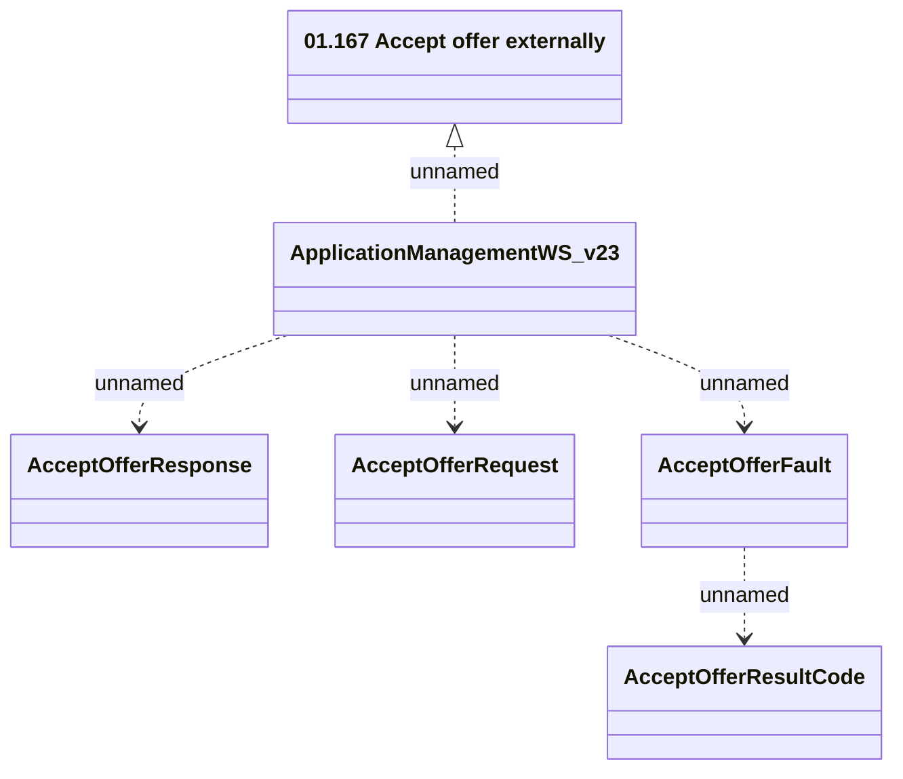

# ApplicationManagementWS_v23 - AcceptOffer

- **Diagram Type**: Logical
- **Package**: HomerSelect/BSL/Analysis Model/_Interface/Provided Web Services/Application/ApplicationManagementWS/{DEL}ApplicationManagementWS_v23
- **Diagram ID**: 153293
- **Elements**: 6
- **Connectors**: 5

