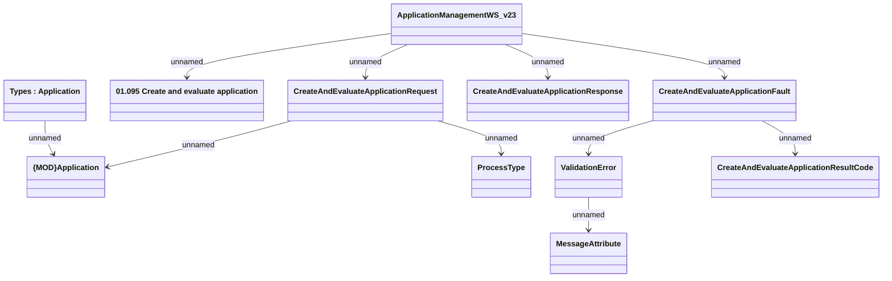

# ApplicationManagementWS_v23 - CreateAndEvaluateApplication

```mermaid
classDiagram
    class Types_Application["Types : Application"]
    class n_01_095_Create_and_evaluate_application["01.095 Create and evaluate application"]
    class MOD_Application["{MOD}Application"]
    class ProcessType["ProcessType"]
    class MessageAttribute["MessageAttribute"]
    class ValidationError["ValidationError"]
    class CreateAndEvaluateApplicationResultCode["CreateAndEvaluateApplicationResultCode"]
    class CreateAndEvaluateApplicationRequest["CreateAndEvaluateApplicationRequest"]
    class CreateAndEvaluateApplicationResponse["CreateAndEvaluateApplicationResponse"]
    class CreateAndEvaluateApplicationFault["CreateAndEvaluateApplicationFault"]
    class ApplicationManagementWS_v23["ApplicationManagementWS_v23"]
    ApplicationManagementWS_v23 --> CreateAndEvaluateApplicationFault : unnamed
    ApplicationManagementWS_v23 --> CreateAndEvaluateApplicationResponse : unnamed
    ApplicationManagementWS_v23 --> CreateAndEvaluateApplicationRequest : unnamed
    CreateAndEvaluateApplicationFault --> CreateAndEvaluateApplicationResultCode : unnamed
    CreateAndEvaluateApplicationFault --> ValidationError : unnamed
    ValidationError --> MessageAttribute : unnamed
    CreateAndEvaluateApplicationRequest --> ProcessType : unnamed
    Types_Application --> MOD_Application : unnamed
    CreateAndEvaluateApplicationRequest --> MOD_Application : unnamed
    ApplicationManagementWS_v23 --> n_01_095_Create_and_evaluate_application : unnamed
```
