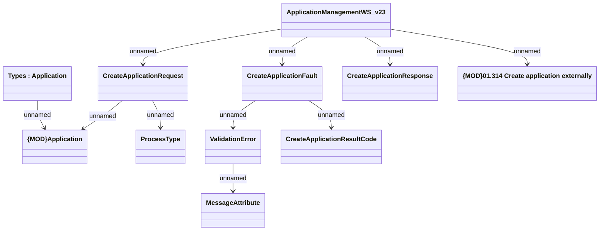

# ApplicationManagementWS_v23 - CreateApplication

```mermaid
classDiagram
    class Types_Application["Types : Application"]
    class MOD_01_314_Create_application_externally["{MOD}01.314 Create application externally"]
    class CreateApplicationResultCode["CreateApplicationResultCode"]
    class ProcessType["ProcessType"]
    class MessageAttribute["MessageAttribute"]
    class ValidationError["ValidationError"]
    class MOD_Application["{MOD}Application"]
    class CreateApplicationResponse["CreateApplicationResponse"]
    class CreateApplicationFault["CreateApplicationFault"]
    class CreateApplicationRequest["CreateApplicationRequest"]
    class ApplicationManagementWS_v23["ApplicationManagementWS_v23"]
    ApplicationManagementWS_v23 --> CreateApplicationRequest : unnamed
    ApplicationManagementWS_v23 --> CreateApplicationFault : unnamed
    ApplicationManagementWS_v23 --> CreateApplicationResponse : unnamed
    Types_Application --> MOD_Application : unnamed
    CreateApplicationRequest --> MOD_Application : unnamed
    CreateApplicationFault --> ValidationError : unnamed
    ValidationError --> MessageAttribute : unnamed
    CreateApplicationRequest --> ProcessType : unnamed
    CreateApplicationFault --> CreateApplicationResultCode : unnamed
    ApplicationManagementWS_v23 --> MOD_01_314_Create_application_externally : unnamed
```
