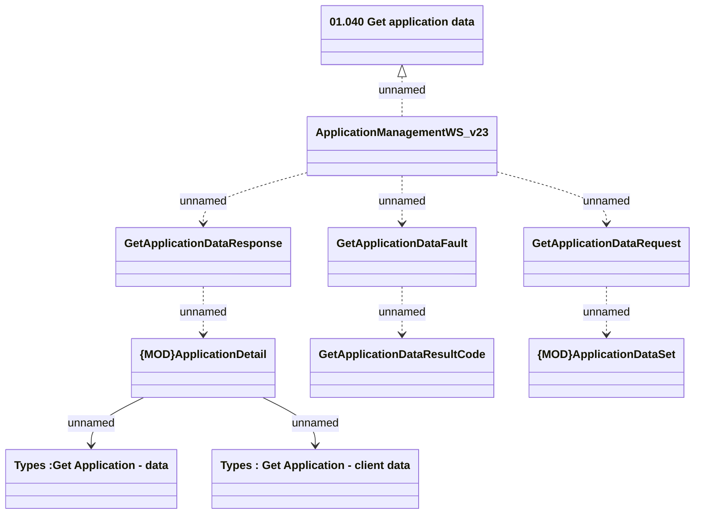

# ApplicationManagementWS_v23 - GetApplicationData

- **Diagram Type**: Logical
- **Package**: HomerSelect/BSL/Analysis Model/_Interface/Provided Web Services/Application/ApplicationManagementWS/{DEL}ApplicationManagementWS_v23
- **Diagram ID**: 153281
- **Elements**: 10
- **Connectors**: 9

