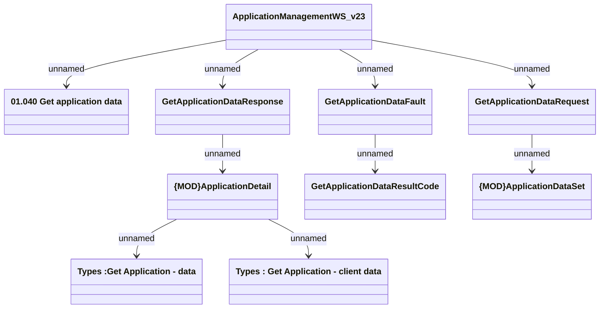

# ApplicationManagementWS_v23 - GetApplicationData

```mermaid
classDiagram
    class Types_Get_Application_client_data["Types : Get Application - client data"]
    class Types_Get_Application_data["Types :Get Application - data"]
    class n_01_040_Get_application_data["01.040 Get application data"]
    class MOD_ApplicationDetail["{MOD}ApplicationDetail"]
    class GetApplicationDataResultCode["GetApplicationDataResultCode"]
    class MOD_ApplicationDataSet["{MOD}ApplicationDataSet"]
    class GetApplicationDataResponse["GetApplicationDataResponse"]
    class GetApplicationDataRequest["GetApplicationDataRequest"]
    class GetApplicationDataFault["GetApplicationDataFault"]
    class ApplicationManagementWS_v23["ApplicationManagementWS_v23"]
    ApplicationManagementWS_v23 --> GetApplicationDataFault : unnamed
    ApplicationManagementWS_v23 --> GetApplicationDataRequest : unnamed
    ApplicationManagementWS_v23 --> GetApplicationDataResponse : unnamed
    GetApplicationDataRequest --> MOD_ApplicationDataSet : unnamed
    GetApplicationDataFault --> GetApplicationDataResultCode : unnamed
    GetApplicationDataResponse --> MOD_ApplicationDetail : unnamed
    ApplicationManagementWS_v23 --> n_01_040_Get_application_data : unnamed
    MOD_ApplicationDetail --> Types_Get_Application_data : unnamed
    MOD_ApplicationDetail --> Types_Get_Application_client_data : unnamed
```
