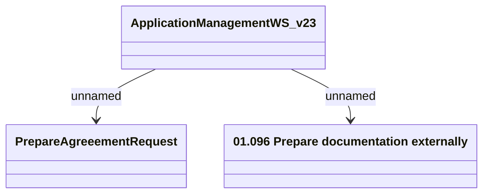

# ApplicationManagementWS_v23 - PrepareAgreeement

```mermaid
classDiagram
    class n_01_096_Prepare_documentation_externally["01.096 Prepare documentation externally"]
    class PrepareAgreeementRequest["PrepareAgreeementRequest"]
    class ApplicationManagementWS_v23["ApplicationManagementWS_v23"]
    ApplicationManagementWS_v23 --> PrepareAgreeementRequest : unnamed
    ApplicationManagementWS_v23 --> n_01_096_Prepare_documentation_externally : unnamed
```
