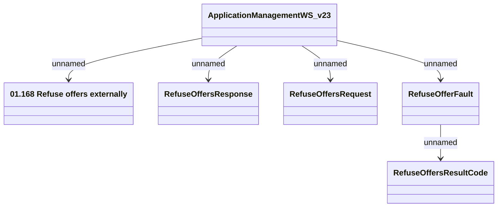

# ApplicationManagementWS_v23 - RefuseOffers

```mermaid
classDiagram
    class n_01_168_Refuse_offers_externally["01.168 Refuse offers externally"]
    class RefuseOffersResultCode["RefuseOffersResultCode"]
    class RefuseOffersResponse["RefuseOffersResponse"]
    class RefuseOffersRequest["RefuseOffersRequest"]
    class RefuseOfferFault["RefuseOfferFault"]
    class ApplicationManagementWS_v23["ApplicationManagementWS_v23"]
    ApplicationManagementWS_v23 --> RefuseOfferFault : unnamed
    ApplicationManagementWS_v23 --> RefuseOffersRequest : unnamed
    ApplicationManagementWS_v23 --> RefuseOffersResponse : unnamed
    RefuseOfferFault --> RefuseOffersResultCode : unnamed
    ApplicationManagementWS_v23 --> n_01_168_Refuse_offers_externally : unnamed
```
