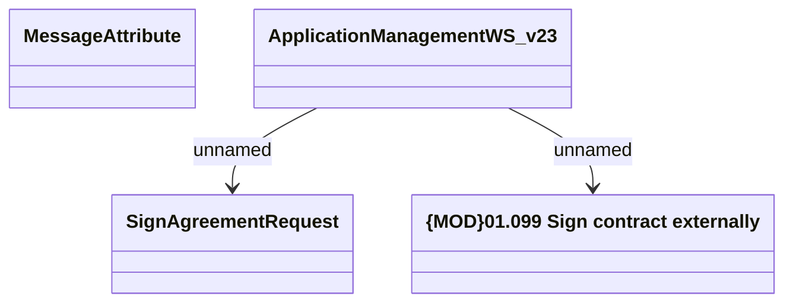

# ApplicationManagementWS_v23 - SignAgreement

```mermaid
classDiagram
    class MessageAttribute["MessageAttribute"]
    class MOD_01_099_Sign_contract_externally["{MOD}01.099 Sign contract externally"]
    class SignAgreementRequest["SignAgreementRequest"]
    class ApplicationManagementWS_v23["ApplicationManagementWS_v23"]
    ApplicationManagementWS_v23 --> SignAgreementRequest : unnamed
    ApplicationManagementWS_v23 --> MOD_01_099_Sign_contract_externally : unnamed
```
