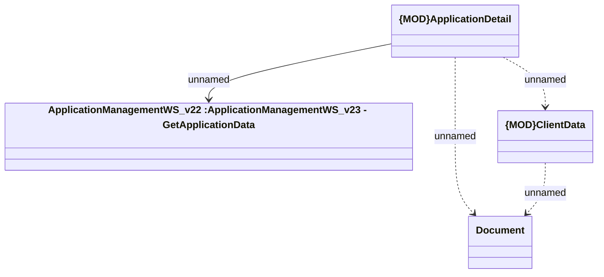

# Get Application - client data

- **Diagram Type**: Logical
- **Package**: HomerSelect/BSL/Analysis Model/_Interface/Provided Web Services/Application/ApplicationManagementWS/{DEL}ApplicationManagementWS_v23/Types
- **Diagram ID**: 153294
- **Elements**: 4
- **Connectors**: 4

