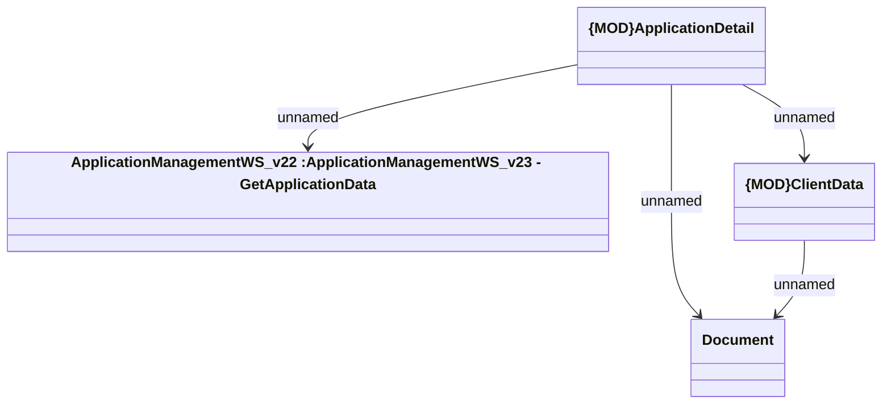

# Get Application - client data

```mermaid
classDiagram
    class Document["Document"]
    class ApplicationManagementWS_v22_ApplicationManagementWS_v23_GetA["ApplicationManagementWS_v22 :ApplicationManagementWS_v23 - GetApplicationData"]
    class MOD_ClientData["{MOD}ClientData"]
    class MOD_ApplicationDetail["{MOD}ApplicationDetail"]
    MOD_ApplicationDetail --> MOD_ClientData : unnamed
    MOD_ApplicationDetail --> ApplicationManagementWS_v22_ApplicationManagementWS_v23_GetA : unnamed
    MOD_ApplicationDetail --> Document : unnamed
    MOD_ClientData --> Document : unnamed
```
