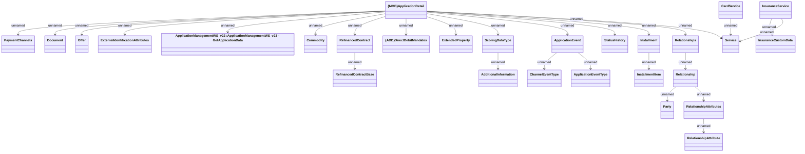

# Get Application - data

```mermaid
classDiagram
    class ADD_DirectDebitMandates["{ADD}DirectDebitMandates"]
    class PaymentChannels["PaymentChannels"]
    class Document["Document"]
    class Offer["Offer"]
    class ExternalIdentificationAttributes["ExternalIdentificationAttributes"]
    class ChannelEventType["ChannelEventType"]
    class ApplicationManagementWS_v22_ApplicationManagementWS_v23_GetA["ApplicationManagementWS_v22 :ApplicationManagementWS_v23 - GetApplicationData"]
    class Commodity["Commodity"]
    class RefinancedContractBase["RefinancedContractBase"]
    class RefinancedContract["RefinancedContract"]
    class AdditionalInformation["AdditionalInformation"]
    class CardService["CardService"]
    class InsuranceCustomData["InsuranceCustomData"]
    class InsuranceService["InsuranceService"]
    class Service["Service"]
    class ExtendedProperty["ExtendedProperty"]
    class ScoringDataType["ScoringDataType"]
    class ApplicationEventType["ApplicationEventType"]
    class ApplicationEvent["ApplicationEvent"]
    class StatusHistory["StatusHistory"]
    class InstallmentItem["InstallmentItem"]
    class Installment["Installment"]
    class MOD_ApplicationDetail["{MOD}ApplicationDetail"]
    class RelationshipAttribute["RelationshipAttribute"]
    class RelationshipAttributes["RelationshipAttributes"]
    class Relationship["Relationship"]
    class Relationships["Relationships"]
    class Party["Party"]
    CardService --> Service : unnamed
    MOD_ApplicationDetail --> PaymentChannels : unnamed
    MOD_ApplicationDetail --> Document : unnamed
    MOD_ApplicationDetail --> Offer : unnamed
    MOD_ApplicationDetail --> ExternalIdentificationAttributes : unnamed
    ApplicationEvent --> ChannelEventType : unnamed
    MOD_ApplicationDetail --> ApplicationManagementWS_v22_ApplicationManagementWS_v23_GetA : unnamed
    MOD_ApplicationDetail --> Commodity : unnamed
    RefinancedContract --> RefinancedContractBase : unnamed
    MOD_ApplicationDetail --> RefinancedContract : unnamed
    ScoringDataType --> AdditionalInformation : unnamed
    InsuranceService --> InsuranceCustomData : unnamed
    MOD_ApplicationDetail --> ADD_DirectDebitMandates : unnamed
    InsuranceService --> Service : unnamed
    Relationship --> Party : unnamed
    MOD_ApplicationDetail --> ExtendedProperty : unnamed
    MOD_ApplicationDetail --> ScoringDataType : unnamed
    ApplicationEvent --> ApplicationEventType : unnamed
    MOD_ApplicationDetail --> ApplicationEvent : unnamed
    MOD_ApplicationDetail --> StatusHistory : unnamed
    Installment --> InstallmentItem : unnamed
    MOD_ApplicationDetail --> Installment : unnamed
    RelationshipAttributes --> RelationshipAttribute : unnamed
    Relationship --> RelationshipAttributes : unnamed
    Relationships --> Relationship : unnamed
    MOD_ApplicationDetail --> Relationships : unnamed
    MOD_ApplicationDetail --> Service : unnamed
```
