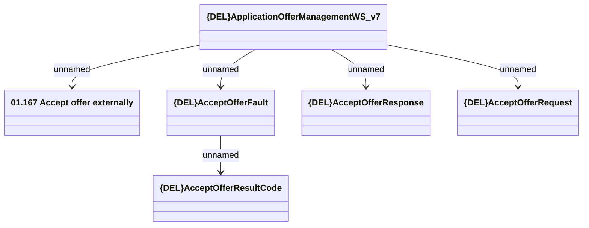

# ApplicationOfferManagementWS_v7 - Accept Offer

```mermaid
classDiagram
    class DEL_AcceptOfferResultCode["{DEL}AcceptOfferResultCode"]
    class n_01_167_Accept_offer_externally["01.167 Accept offer externally"]
    class DEL_ApplicationOfferManagementWS_v7["{DEL}ApplicationOfferManagementWS_v7"]
    class DEL_AcceptOfferFault["{DEL}AcceptOfferFault"]
    class DEL_AcceptOfferResponse["{DEL}AcceptOfferResponse"]
    class DEL_AcceptOfferRequest["{DEL}AcceptOfferRequest"]
    DEL_ApplicationOfferManagementWS_v7 --> DEL_AcceptOfferRequest : unnamed
    DEL_ApplicationOfferManagementWS_v7 --> DEL_AcceptOfferResponse : unnamed
    DEL_ApplicationOfferManagementWS_v7 --> DEL_AcceptOfferFault : unnamed
    DEL_ApplicationOfferManagementWS_v7 --> n_01_167_Accept_offer_externally : unnamed
    DEL_AcceptOfferFault --> DEL_AcceptOfferResultCode : unnamed
```
