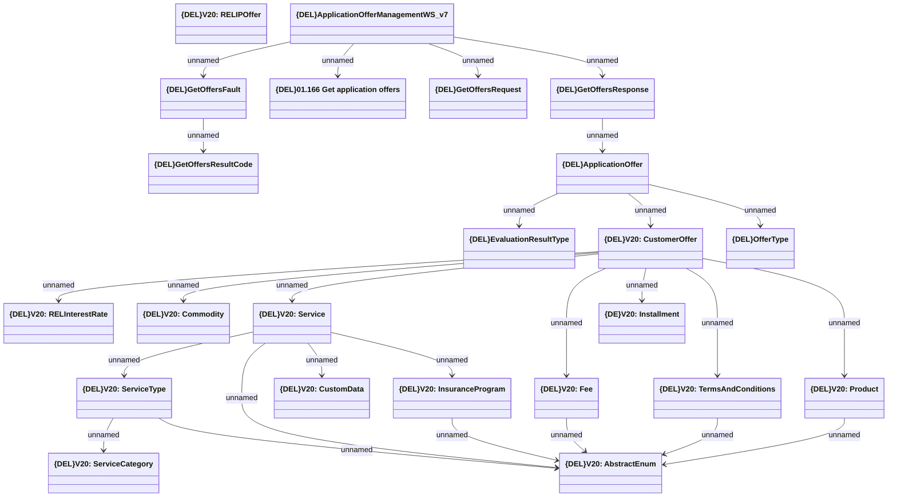

# ApplicationOfferManagementWS_v7 - Get Offers

```mermaid
classDiagram
    class DEL_V20_CustomData["{DEL}V20: CustomData"]
    class DEL_V20_RELInterestRate["{DEL}V20: RELInterestRate"]
    class DEL_V20_ServiceCategory["{DEL}V20: ServiceCategory"]
    class DEL_V20_AbstractEnum["{DEL}V20: AbstractEnum"]
    class DEL_GetOffersResultCode["{DEL}GetOffersResultCode"]
    class DEL_EvaluationResultType["{DEL}EvaluationResultType"]
    class DEL_OfferType["{DEL}OfferType"]
    class DEL_V20_RELIPOffer["{DEL}V20: RELIPOffer"]
    class DEL_V20_InsuranceProgram["{DEL}V20: InsuranceProgram"]
    class DEL_V20_ServiceType["{DEL}V20: ServiceType"]
    class DEL_V20_Commodity["{DEL}V20: Commodity"]
    class DEL_V20_Service["{DEL}V20: Service"]
    class DEL_V20_Fee["{DEL}V20: Fee"]
    class DE_V20_Installment["{DE}V20: Installment"]
    class DEL_V20_TermsAndConditions["{DEL}V20: TermsAndConditions"]
    class DEL_V20_Product["{DEL}V20: Product"]
    class DEL_V20_CustomerOffer["{DEL}V20: CustomerOffer"]
    class DEL_ApplicationOffer["{DEL}ApplicationOffer"]
    class DEL_01_166_Get_application_offers["{DEL}01.166 Get application offers"]
    class DEL_ApplicationOfferManagementWS_v7["{DEL}ApplicationOfferManagementWS_v7"]
    class DEL_GetOffersRequest["{DEL}GetOffersRequest"]
    class DEL_GetOffersResponse["{DEL}GetOffersResponse"]
    class DEL_GetOffersFault["{DEL}GetOffersFault"]
    DEL_V20_Service --> DEL_V20_ServiceType : unnamed
    DEL_V20_CustomerOffer --> DEL_V20_RELInterestRate : unnamed
    DEL_V20_ServiceType --> DEL_V20_ServiceCategory : unnamed
    DEL_V20_TermsAndConditions --> DEL_V20_AbstractEnum : unnamed
    DEL_V20_Service --> DEL_V20_AbstractEnum : unnamed
    DEL_V20_Fee --> DEL_V20_AbstractEnum : unnamed
    DEL_V20_ServiceType --> DEL_V20_AbstractEnum : unnamed
    DEL_V20_InsuranceProgram --> DEL_V20_AbstractEnum : unnamed
    DEL_V20_Product --> DEL_V20_AbstractEnum : unnamed
    DEL_GetOffersFault --> DEL_GetOffersResultCode : unnamed
    DEL_ApplicationOffer --> DEL_EvaluationResultType : unnamed
    DEL_V20_Service --> DEL_V20_CustomData : unnamed
    DEL_V20_Service --> DEL_V20_InsuranceProgram : unnamed
    DEL_ApplicationOfferManagementWS_v7 --> DEL_GetOffersFault : unnamed
    DEL_V20_CustomerOffer --> DEL_V20_Commodity : unnamed
    DEL_V20_CustomerOffer --> DEL_V20_Service : unnamed
    DEL_V20_CustomerOffer --> DEL_V20_Fee : unnamed
    DEL_V20_CustomerOffer --> DE_V20_Installment : unnamed
    DEL_V20_CustomerOffer --> DEL_V20_TermsAndConditions : unnamed
    DEL_V20_CustomerOffer --> DEL_V20_Product : unnamed
    DEL_ApplicationOffer --> DEL_V20_CustomerOffer : unnamed
    DEL_GetOffersResponse --> DEL_ApplicationOffer : unnamed
    DEL_ApplicationOfferManagementWS_v7 --> DEL_01_166_Get_application_offers : unnamed
    DEL_ApplicationOfferManagementWS_v7 --> DEL_GetOffersRequest : unnamed
    DEL_ApplicationOfferManagementWS_v7 --> DEL_GetOffersResponse : unnamed
    DEL_ApplicationOffer --> DEL_OfferType : unnamed
```
