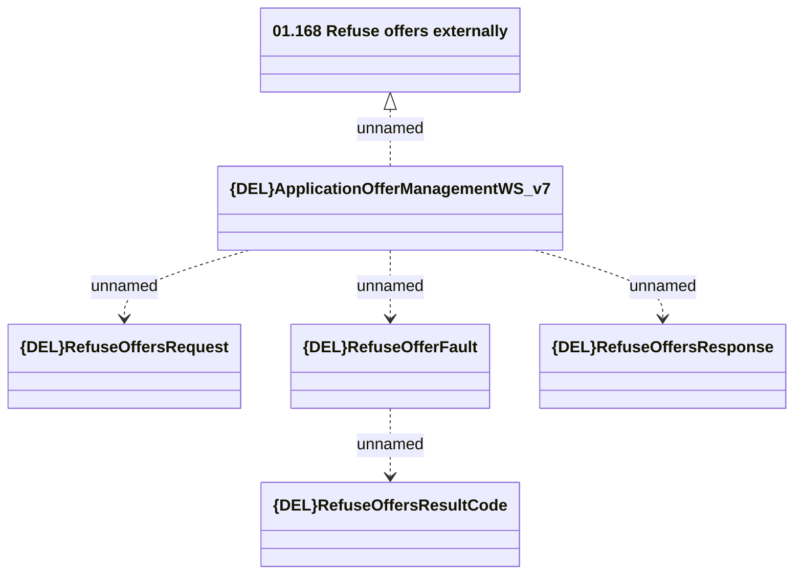

# ApplicationOfferManagementWS_v7 - Refuse Offers

- **Diagram Type**: Logical
- **Package**: HomerSelect/BSL/Analysis Model/_Interface/Provided Web Services/Application/ApplicationOfferManagementWS/{DEL}ApplicationOfferManagementWS_v7
- **Diagram ID**: 157798
- **Elements**: 6
- **Connectors**: 5

