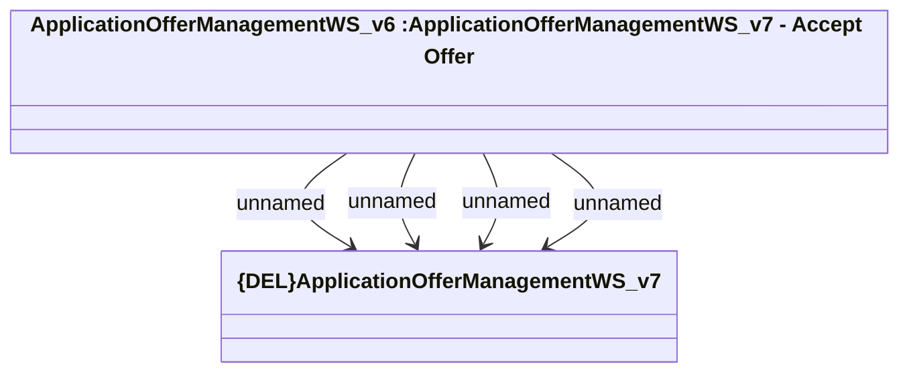

# ApplicationOfferManagementWS_v7

```mermaid
classDiagram
    class ApplicationOfferManagementWS_v6_ApplicationOfferManagementWS["ApplicationOfferManagementWS_v6 :ApplicationOfferManagementWS_v7 - Update Offer"]
    class ApplicationOfferManagementWS_v6_ApplicationOfferManagementWS["ApplicationOfferManagementWS_v6 :ApplicationOfferManagementWS_v7 - Refuse Offers"]
    class ApplicationOfferManagementWS_v6_ApplicationOfferManagementWS["ApplicationOfferManagementWS_v6 :ApplicationOfferManagementWS_v7 - Get Offers"]
    class ApplicationOfferManagementWS_v6_ApplicationOfferManagementWS["ApplicationOfferManagementWS_v6 :ApplicationOfferManagementWS_v7 - Accept Offer"]
    class DEL_ApplicationOfferManagementWS_v7["{DEL}ApplicationOfferManagementWS_v7"]
    ApplicationOfferManagementWS_v6_ApplicationOfferManagementWS --> DEL_ApplicationOfferManagementWS_v7 : unnamed
    ApplicationOfferManagementWS_v6_ApplicationOfferManagementWS --> DEL_ApplicationOfferManagementWS_v7 : unnamed
    ApplicationOfferManagementWS_v6_ApplicationOfferManagementWS --> DEL_ApplicationOfferManagementWS_v7 : unnamed
    ApplicationOfferManagementWS_v6_ApplicationOfferManagementWS --> DEL_ApplicationOfferManagementWS_v7 : unnamed
```
