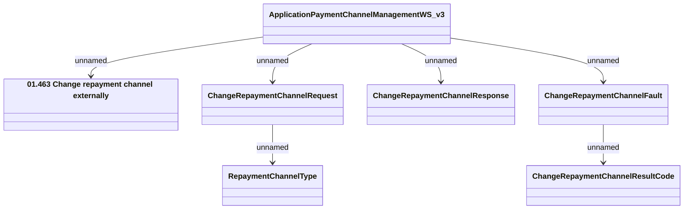

# ApplicationPaymentChannelManagementWS_v3 - Change Repayment Channel

```mermaid
classDiagram
    class n_01_463_Change_repayment_channel_externally["01.463 Change repayment channel externally"]
    class ChangeRepaymentChannelResultCode["ChangeRepaymentChannelResultCode"]
    class RepaymentChannelType["RepaymentChannelType"]
    class ChangeRepaymentChannelFault["ChangeRepaymentChannelFault"]
    class ChangeRepaymentChannelResponse["ChangeRepaymentChannelResponse"]
    class ChangeRepaymentChannelRequest["ChangeRepaymentChannelRequest"]
    class ApplicationPaymentChannelManagementWS_v3["ApplicationPaymentChannelManagementWS_v3"]
    ApplicationPaymentChannelManagementWS_v3 --> ChangeRepaymentChannelRequest : unnamed
    ApplicationPaymentChannelManagementWS_v3 --> ChangeRepaymentChannelResponse : unnamed
    ApplicationPaymentChannelManagementWS_v3 --> ChangeRepaymentChannelFault : unnamed
    ChangeRepaymentChannelRequest --> RepaymentChannelType : unnamed
    ChangeRepaymentChannelFault --> ChangeRepaymentChannelResultCode : unnamed
    ApplicationPaymentChannelManagementWS_v3 --> n_01_463_Change_repayment_channel_externally : unnamed
```
