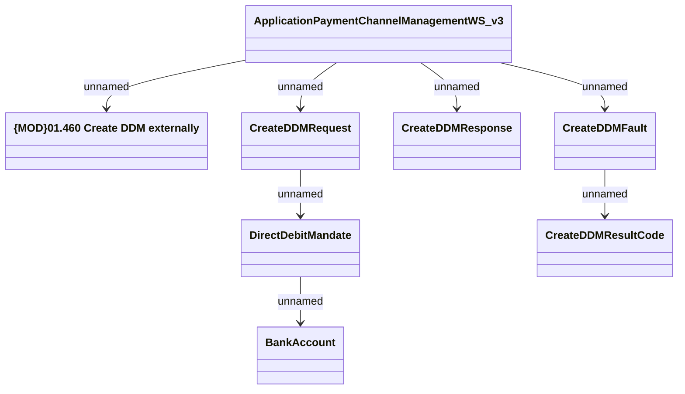

# ApplicationPaymentChannelManagementWS_v3 - Create DDM

```mermaid
classDiagram
    class BankAccount["BankAccount"]
    class DirectDebitMandate["DirectDebitMandate"]
    class MOD_01_460_Create_DDM_externally["{MOD}01.460 Create DDM externally"]
    class CreateDDMResultCode["CreateDDMResultCode"]
    class CreateDDMFault["CreateDDMFault"]
    class CreateDDMResponse["CreateDDMResponse"]
    class CreateDDMRequest["CreateDDMRequest"]
    class ApplicationPaymentChannelManagementWS_v3["ApplicationPaymentChannelManagementWS_v3"]
    ApplicationPaymentChannelManagementWS_v3 --> CreateDDMRequest : unnamed
    ApplicationPaymentChannelManagementWS_v3 --> CreateDDMResponse : unnamed
    ApplicationPaymentChannelManagementWS_v3 --> CreateDDMFault : unnamed
    CreateDDMFault --> CreateDDMResultCode : unnamed
    ApplicationPaymentChannelManagementWS_v3 --> MOD_01_460_Create_DDM_externally : unnamed
    CreateDDMRequest --> DirectDebitMandate : unnamed
    DirectDebitMandate --> BankAccount : unnamed
```
