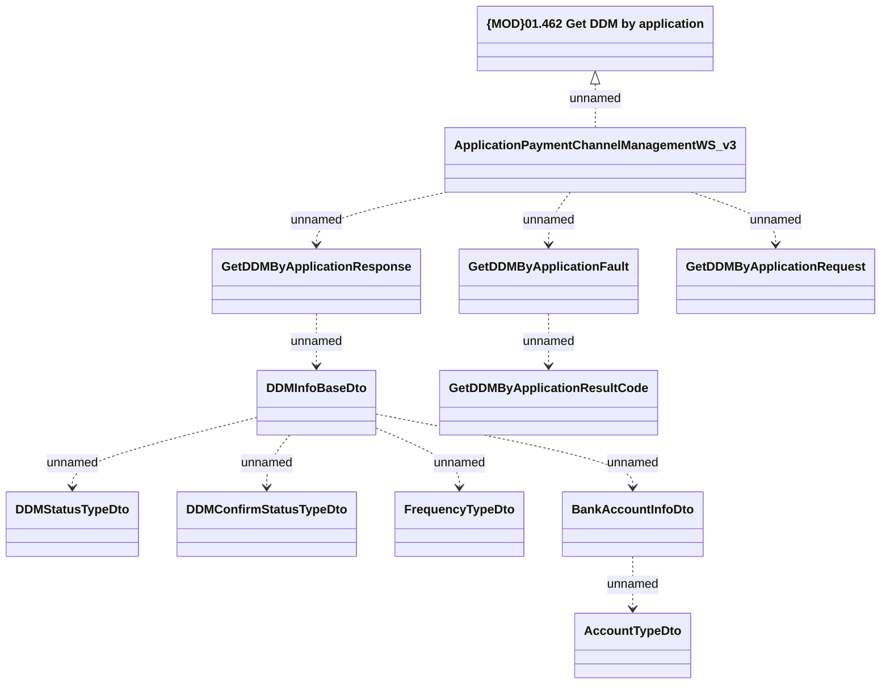

# ApplicationPaymentChannelManagementWS_v3 - Get DDM by Contract

- **Diagram Type**: Logical
- **Package**: HomerSelect/BSL/Analysis Model/_Interface/Provided Web Services/Application/ApplicationPaymentChannelManagementWS/ApplicationPaymentChannelManagementWS_v3
- **Diagram ID**: 158227
- **Elements**: 12
- **Connectors**: 11

