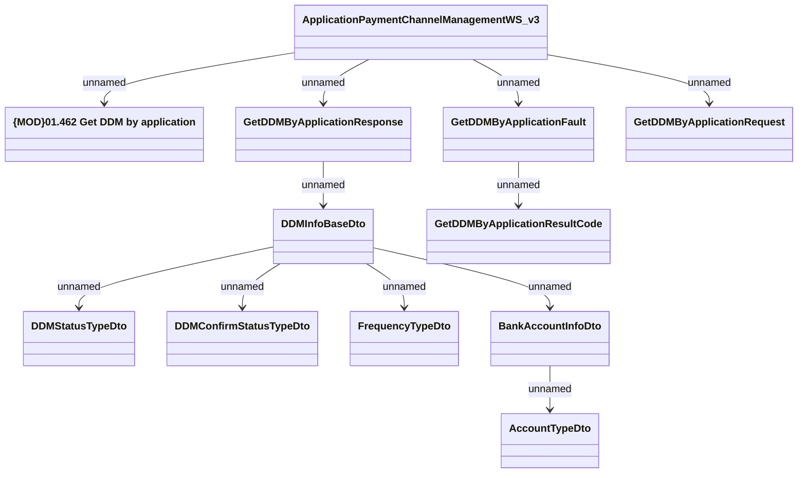

# ApplicationPaymentChannelManagementWS_v3 - Get DDM by Contract

```mermaid
classDiagram
    class DDMStatusTypeDto["DDMStatusTypeDto"]
    class DDMConfirmStatusTypeDto["DDMConfirmStatusTypeDto"]
    class FrequencyTypeDto["FrequencyTypeDto"]
    class AccountTypeDto["AccountTypeDto"]
    class BankAccountInfoDto["BankAccountInfoDto"]
    class DDMInfoBaseDto["DDMInfoBaseDto"]
    class GetDDMByApplicationResultCode["GetDDMByApplicationResultCode"]
    class MOD_01_462_Get_DDM_by_application["{MOD}01.462 Get DDM by application"]
    class GetDDMByApplicationFault["GetDDMByApplicationFault"]
    class GetDDMByApplicationResponse["GetDDMByApplicationResponse"]
    class GetDDMByApplicationRequest["GetDDMByApplicationRequest"]
    class ApplicationPaymentChannelManagementWS_v3["ApplicationPaymentChannelManagementWS_v3"]
    ApplicationPaymentChannelManagementWS_v3 --> GetDDMByApplicationRequest : unnamed
    ApplicationPaymentChannelManagementWS_v3 --> GetDDMByApplicationResponse : unnamed
    ApplicationPaymentChannelManagementWS_v3 --> GetDDMByApplicationFault : unnamed
    ApplicationPaymentChannelManagementWS_v3 --> MOD_01_462_Get_DDM_by_application : unnamed
    GetDDMByApplicationFault --> GetDDMByApplicationResultCode : unnamed
    GetDDMByApplicationResponse --> DDMInfoBaseDto : unnamed
    DDMInfoBaseDto --> BankAccountInfoDto : unnamed
    BankAccountInfoDto --> AccountTypeDto : unnamed
    DDMInfoBaseDto --> FrequencyTypeDto : unnamed
    DDMInfoBaseDto --> DDMConfirmStatusTypeDto : unnamed
    DDMInfoBaseDto --> DDMStatusTypeDto : unnamed
```
