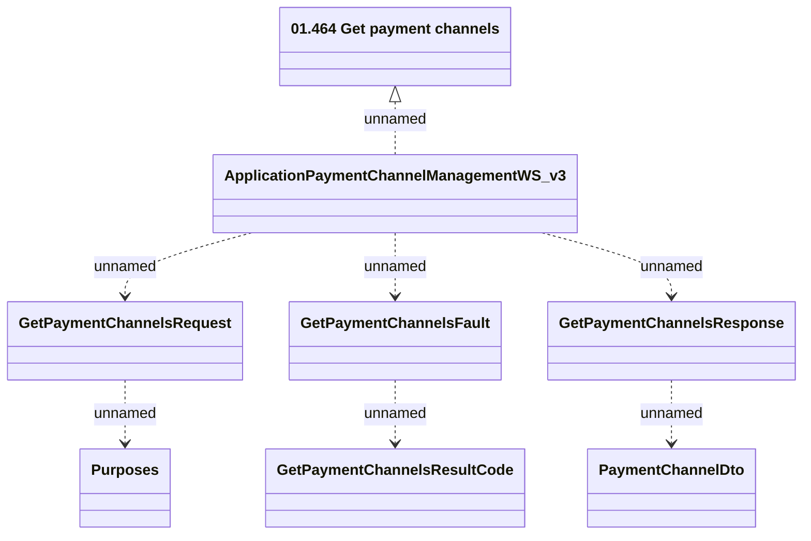

# ApplicationPaymentChannelManagementWS_v3 - Get Payment Channels

- **Diagram Type**: Logical
- **Package**: HomerSelect/BSL/Analysis Model/_Interface/Provided Web Services/Application/ApplicationPaymentChannelManagementWS/ApplicationPaymentChannelManagementWS_v3
- **Diagram ID**: 158230
- **Elements**: 8
- **Connectors**: 7

