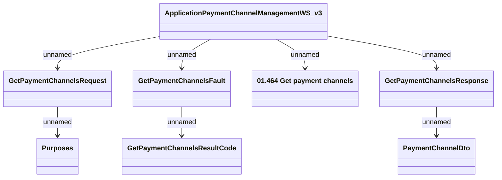

# ApplicationPaymentChannelManagementWS_v3 - Get Payment Channels

```mermaid
classDiagram
    class Purposes["Purposes"]
    class PaymentChannelDto["PaymentChannelDto"]
    class GetPaymentChannelsResponse["GetPaymentChannelsResponse"]
    class GetPaymentChannelsResultCode["GetPaymentChannelsResultCode"]
    class GetPaymentChannelsFault["GetPaymentChannelsFault"]
    class n_01_464_Get_payment_channels["01.464 Get payment channels"]
    class GetPaymentChannelsRequest["GetPaymentChannelsRequest"]
    class ApplicationPaymentChannelManagementWS_v3["ApplicationPaymentChannelManagementWS_v3"]
    ApplicationPaymentChannelManagementWS_v3 --> GetPaymentChannelsRequest : unnamed
    ApplicationPaymentChannelManagementWS_v3 --> n_01_464_Get_payment_channels : unnamed
    ApplicationPaymentChannelManagementWS_v3 --> GetPaymentChannelsFault : unnamed
    GetPaymentChannelsFault --> GetPaymentChannelsResultCode : unnamed
    ApplicationPaymentChannelManagementWS_v3 --> GetPaymentChannelsResponse : unnamed
    GetPaymentChannelsResponse --> PaymentChannelDto : unnamed
    GetPaymentChannelsRequest --> Purposes : unnamed
```
